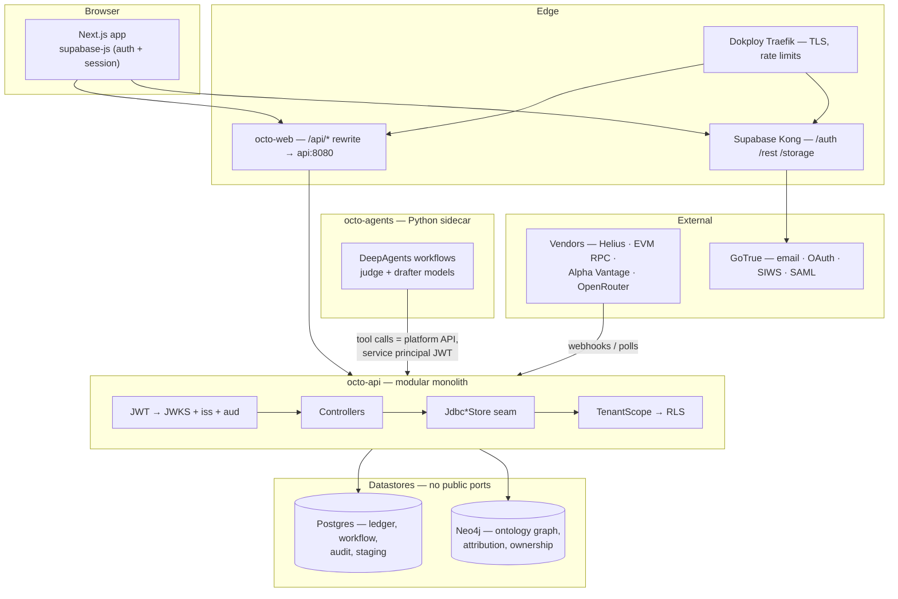
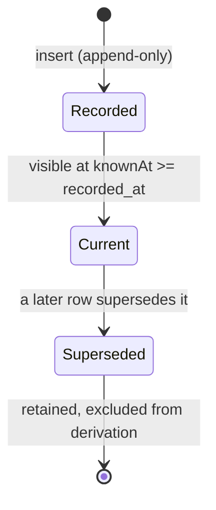
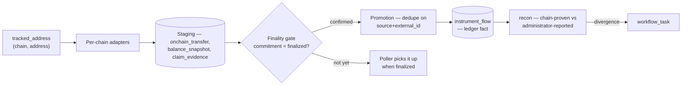

# Octo — The Governed Book of Record for Private Markets

*A system whitepaper. Status markers (✅ built, 🟡 in flight, ⬜ planned) reflect the
codebase at `main` HEAD; every claim links to the document or code path behind it.*

## Abstract

Octo is a private-equity portfolio-management platform built around one rule: **one
database, one system, one process**. An append-only Investment Book of Record (IBOR)
holds every financial fact; a versioned investment ontology defines what entities and
claims may exist; continuous reconciliation compares the record against its sources —
including finalized state read directly from public blockchains; and a governed agent
layer drafts, screens, and narrates under a hard separation between proposing and
disposing. Positions are derived from the ledger and never written. Corrections are
new rows, never edits. Agents open tasks and drafts, never the ledger, and never
approve their own output.

## 1. The problem

Private markets run on the largest pool of opaque assets in the world, and their
"books of record" are assembled from PDFs, spreadsheets, CRMs, fund administrators,
and market-data feeds — each with its own identifiers, formats, and timing. The
result, observable inside almost any fund operation:

- **No centralized view.** The same commitment, position, or claim exists in five
  systems that disagree with each other.
- **Duplicated process.** Every team re-derives the same numbers for its own report.
- **Unverifiable sources.** Administrator-reported positions are accepted on trust
  because nothing else can check them.
- **Inconsistent methodology.** Two analysts produce two IRRs for the same fund.
- **AI without a spine.** Generative tools bolted onto ungoverned data produce
  confident, unprovable prose — the one thing a regulated firm cannot ship.

The problem is structural: each tool owns a slice of truth and none of them reconcile
against each other, so discrepancies surface at quarter-end — or never.

## 2. Design principles

Six rules govern everything below them:

| # | Principle | Mechanism | Source |
| --- | --- | --- | --- |
| 1 | The IBOR is derived, never written | Positions, called capital, and investor cash flows are computed from the append-only ledger at read time; no mutable position table exists to drift | [ADR-0001](docs/adr/0001-platform-architecture.md) §3 |
| 2 | Vendor neutrality is architectural, not aspirational | No module outside `ingestion` may depend on a vendor API or format — enforced by `ModuleBoundaryTest` in CI | [ADR-0001](docs/adr/0001-platform-architecture.md) consequences |
| 3 | Staging before promotion | Untrusted source data lands in staging; verified transition to ledger facts is a separate, deduplicated step | [concepts.md](docs/concepts.md) |
| 4 | Read-only onchain boundary | The platform never holds keys, signs, or submits transactions — it only *reads* finalized state | `modules/ingestion/.../onchain/` |
| 5 | AI proposes, humans dispose | Agents draft and score; outbound artifacts require human approval; agents have no approval power | [user-experience.md](docs/user-experience.md), [ADR-0005](docs/adr/0005-python-agent-sidecar.md) |
| 6 | Every number defends itself | Metrics carry formula version + input lineage to ledger events and source documents | [quantitative-methodology.md](docs/quantitative-methodology.md) |

## 3. Architecture

One deployable Kotlin/Spring Boot modular monolith, two data stores with separate
ownership, and an agent sidecar with no public route:

### Module map

Gradle enforces the dependency graph — `ModuleBoundaryTest` fails CI on any new
arrow. `api` is the only composition root; domain modules are closed to each other,
so glue (e.g. `ibor-core` output feeding `analytics`) lives in `api`.

| Module | Responsibility |
| --- | --- |
| `ibor-core` | Ledger derivation — commitments, investor cash flows, positions |
| `lookthrough` | Path-sum exposure across ownership hierarchies |
| `analytics` | Metrics engine — performance, risk, factor, regime, valuation, equity bridge |
| `recon` | Source-vs-IBOR reconciliation; post-trade compliance rules |
| `workflow` | Event-sourced tasks, approvals, segregation of duties, report jobs |
| `deal-sourcing` | Prospect pipeline, screening rules, DD checklist, IC gate |
| `ingestion` | Source adapters, onchain collectors, document extraction, staging |
| `control-panel` | Judgment client, data-classification guard |
| `ontology` | SHACL validation, Cypher↔OWL drift checks — the CI gate for `ontology/` |
| `persistence` | `TenantScope`/`scoped()` — the transaction-context seam RLS reads |

### Two stores, one truth

PostgreSQL owns **facts over time** — the ledger, staging, workflow state, audit.
Neo4j owns **entities and relationships** — funds, LPs, GPs, companies, and the
attribution edges linking ledger events to commitments. `ibor-core` never stores
attribution: the caller resolves which event ids belong to a commitment from the
graph and passes them to the derivation. If the graph store drifts or is
unavailable, financial truth is unaffected — Postgres is the ledger of record, and
the graph is rebuildable by replaying ingestion.

### The request path

Every API request resolves its tenant scope before touching data: bearer JWT → JWKS
verification against GoTrue → `TenantDirectory` replays `tenant_member_event` to
compute membership → the transaction opens under `TenantScope`, which sets
`app.user_id`/`app.tenant_ids` GUCs → V27's RLS policies read the same GUCs. An
unscoped call against a tenant-governed table fails closed at the database. The
only deliberate exception is vendor-webhook intake, which writes into
non-tenant-scoped staging tables — staging never is a ledger fact.

## 4. The ledger

The IBOR is append-only by database enforcement, not application convention. Every
fact table rejects UPDATE and DELETE via trigger (`reject_mutation`,
`ledger_event_reject_mutation` — V1, V2); corrections are new rows linked by
`supersedes_id` with a mandatory `rationale`, and a fork (two rows superseding one)
is rejected.

Derivation is deterministic ([system-design.md §3.3](docs/system-design.md)):
bi-temporal cut on `recorded_at` → supersession resolution → filter to the
commitment's attributed event ids → aggregate by flow type → build the investor
series (contributions negative, distributions positive). Mixed currencies fail
loudly; a missing supersession target is an error, not a gap.

The same event-sourced pattern repeats wherever the domain has a lifecycle:
`prospect_event`, `tenant_member_event`, `workflow_task_event`,
`tracked_address_event` — an immutable header row plus an append-only event table,
state derived by replay under a per-subject advisory lock.

Two flow families, one contract: `ledger_event` records ISO-currency flows;
`instrument_flow` records non-ISO flows (tokens, stake accounts) — the ledger's
onchain counterpart. They are split by denomination, not by kind: there is no third
ledger. The hash-chained `audit_event` table sits beside both — every governed
action is recorded with a `prev_hash`/`hash` chain, and `verifyAuditChain` failing
is a page-level alert.

## 5. The investment ontology

The canonical model of what entities, attributes, and relationships may exist lives
in Git: `ontology/octo-investment.cypher` is the Neo4j schema of record, with an
OWL/SHACL mirror; a drift guard in CI (`Neo4jSchemaIT` + Jena SHACL) fails if the
two diverge. SemVer applies; deprecation precedes deletion.

Design rules (from [ontology-design-guidelines.md](docs/ontology-design-guidelines.md),
adapted from concept-centric practice):

- **Domain-driven, never source-shaped.** Types model investment concepts
  (`fund`, `deal`, `limited-partner`, `valuation-event`) — a `PreqinFundRow` is an
  anti-pattern. Vendor shapes stop at adapters.
- **Composition over hierarchy.** Capabilities are roles — anything ownable plays
  `ownership:asset` — and shared attributes are mixins. The deepest chain is three
  levels.
- **One canonical type per concept.** Rule of three triggers consolidation;
  naming debt lives in the alias register, not in forked types.
- **Identity ≠ observation.** A `ledger-event` records an observation *of* a thing;
  it is never the thing.

Validation is operational, not just structural: the guideline's drill sequences run
real business questions against the ontology with participants who didn't build it —
and run the same questions through the agent layer, so tribal knowledge gaps surface
as agent failures rather than as institutional memory loss.

## 6. Onchain integration

On-chain data is a first-class *reconciliation source* — the chain is treated as an
independent auditor of what fund administrators report.

- **Solana** — Helius adapter: enhanced webhooks plus a backfill poller, every RPC
  call pinned to `commitment: "finalized"`. A webhook payload that arrives
  pre-finality is *deferred* — the poller stages it once the chain finalizes
  (`OnchainWebhookService` + `HeliusFinalityProbe`).
- **Arbitrum One** — EVM adapter: every block-scoped call pins the `finalized` tag;
  registered ERC-20 contracts are keyed by `(chain, contract)` with decimals
  resolved on-chain, never assumed.
- **Promotion** — staging rows promote to `instrument_flow` only via
  `InstrumentFlowPromoter` with replay-order rules and `(source_system,
  external_id)` dedupe. A reorg can never corrupt the ledger because unfinalized
  state never reaches it.
- **Claim evidence** — `onchain_claim_evidence` captures append-only,
  evidence-typed observations keyed to a claim and subject address (V16). The
  capture side is built; the screening-side consumption is marked ⬜ planned.

The honest edge: the chain verifies facts — balances, transfers, staking flows,
claims. It does not appraise private companies; valuation stays a methodology
question ([quantitative-methodology.md](docs/quantitative-methodology.md)).

## 7. Analytics

The `analytics` module computes the canonical PE measure set, and every result
carries formula version, input lineage, valuation date, currency, and convention:

| Measure family | Contents | Notes |
| --- | --- | --- |
| Performance | XIRR (actual/365, grid-scan + bisection; non-unique roots → `null`), DPI, RVPI, TVPI, MOIC, commitment status | undefined → `null`, never 0 |
| Benchmark-relative | Kaplan–Schoar PME, direct alpha | benchmark growth-scaled flows |
| Attribution | Brinson allocation/selection/interaction; sequential equity bridge + Shapley order-neutral option | ordering stored with the run |
| Risk | TWR, volatility, Sharpe/Sortino/MDD, VaR/ES; factor and regime models (HMM, Markov-switching, Kalman) | appraisal-smoothed risk labeled as such |
| Exposure | Path-sum look-through — a company held through two funds counts through both; cycles rejected | `lookthrough/Exposure.kt` |
| Valuation | DCF/WACC, comparables, LBO return | peer sets and adjustments stored per run |

Metrics are versioned alongside the schema; a corrected formula is a new version,
never an edit. Low-code authoring lands as versioned metric-DSL definitions in Git,
reviewed like code.

## 8. The governed agent layer

The agent layer is a Python sidecar ([ADR-0005](docs/adr/0005-python-agent-sidecar.md))
on the private network — LangChain DeepAgents orchestration over OpenRouter, with the
Kotlin platform as its only client and its only tool surface.

**Separation of roles is structural.** The approved-model registry
(`agents/models.yaml`) assigns exactly two roles:

- **Judge** — `typesafe/jev-1.13`, called through the typed decisions endpoint
  (`noul`/`choice`/`score` primitives returning probabilities and distributions,
  never prose). It judges; it can never draft.
- **Drafter** — `deepseek/deepseek-v4.1-flash` (registry-pinned), driving DeepAgent
  planning, tool use, and prose. It drafts; it never decides.

Every request carries `provider: {zdr: true, allow_fallbacks: false}` — confidential
payloads route only to zero-data-retention endpoints, and a non-ZDR route is
rejected fail-closed at the client before the transport is reached.

**Nine workflows ship today** (`agents/octo_agents/workflows/`): `screening_dd`,
`due_diligence` (orchestrator + four workstream subagents), `ic_memo`,
`company_brain` (NL query), `ddq_response`, `operating_review`, `lp_report`,
`compliance_rationale`, `equity_bridge` — plus the deterministic `calibration`
analysis.

**The gates, in order:**

1. **Preflight** — a jev `noul` question refuses hollow inputs before any drafter
   spend (`status: refused`, no model call).
2. **Retrieval banding** — per-event `score` questions admit only relevant chunks
   into context.
3. **Warm context** — the tenant's standing brief (thesis, playbook, tone —
   `agents.warm_context` tenant setting, admin-written) is prepended to
   *investigative* drafter prompts only.
4. **Verdict gates** — completeness/thesis/evidence checks on investigative output;
   a pass may open a workflow task (`ic-review`, `EVIDENCE_REQUEST`) — a task, not
   a state change.
5. **Citation gates on sealed narrators** — `lp_report`, `compliance_rationale`,
   and `equity_bridge` deliberately read *no* tenant data: they narrate inline
   facts only, so jev can verify every cited figure byte-for-byte against a closed
   evidence universe. A mis-cited draft is refused, not shipped.
6. **Human outcome loop** — every run lands in `agent_run` with its verdict;
   `POST /agent-runs/{id}/outcome` records the human's accept/reject/override
   (first-write-wins, viewer-blocked), and the `calibration` workflow joins verdict
   vs outcome into per-workflow agreement rates, a disagreement queue, and
   eval-ready cases — the feedback loop that tunes the gates.

**Evals before live.** Every workflow ships normal/edge/injection eval sets
(`agents/evals/`), CI-gated on a threshold — including prompt-injection cases,
because extracted documents are untrusted input and document instructions can never
reach the tool layer.

The boundary that matters: **agents open tasks and drafts, never ledger writes,
never approvals.** The deterministic platform keeps working if the sidecar is down —
agents are additive, not load-bearing.

## 9. Governance and security

| Layer | Mechanism | Where |
| --- | --- | --- |
| Classification | Public → Internal → Confidential → Strictly Confidential; the most restrictive class follows data into prompts, caches, exports, and backups | [data-security-governance.md](docs/data-security-governance.md) |
| Model boundary | `DataClassification.mayLeavePlatform` guard refuses Confidential state before the transport | `control-panel` |
| Access | RBAC + ABAC; scope by tenant/fund/entity/document/field; default deny — a permission gap does not reveal an entity exists | `api`, V8 membership events |
| Isolation | RLS on tenant-scoped tables (V27) + `TenantScope` fail-closed; tiers `pool`/`bridge`/`silo` per tenant (V32) | [ADR-0007](docs/adr/0007-tenant-isolation-tiers.md) |
| Segregation of duties | The requester cannot decide their own approval task — enforced by trigger | `workflow_task_event_segregation` (V5) |
| Audit | Hash-chained `audit_event`; append-only everywhere; every override needs a recorded rationale | V6, V1/V2 |
| Agents | Service-principal JWT, least-privilege surface, no direct DB, per-workflow flags, eval gates, ZDR fail-closed | ADR-0005 |
| Identity | Supabase Auth — email, OAuth, SAML SSO, and Sign-In-with-Solana issuing the same session | `web/` wallet sign-in |

## 10. The product surface

Six tabs — Deal Pipeline, Portfolio Overview, Fund Metrics, Investment Metrics,
Company Details, Control Panel — plus a global NL query bar
([user-workflows.md](docs/user-workflows.md)):

- **Control Panel first.** The morning surface is an inbox of triggered rules,
  drafts, news matches, and tasks — typed, filterable, deep-linking to the affected
  entity. Clearing it means the portfolio is understood.
- **Drill, don't navigate.** Row-click descends portfolio → fund → deal → company
  with filter state carried; every level keeps lineage affordances.
- **Draft-and-approve.** AI drafts preview inline; approve records approver + diff;
  reject feeds the eval set. Nothing self-executes.
- **Recon is a queue, not a report.** Breaks show source vs IBOR side by side with
  the mapping rule that produced them; resolutions are explicit and audited — no
  "ignore" button.
- **Permission-scoped everything.** NL query, alerts, and exports inherit the
  caller's scope; restricted entities don't render as locked tiles — they don't
  exist in that view.

## 11. Operations

Self-hosted Supabase (PostgreSQL + Auth + Storage) under Dokploy Compose on
controlled infrastructure; Flyway is the only production migration mechanism, and an
applied migration is never edited. The public surface is the reverse proxy alone —
databases, Neo4j bolt, the sidecar, and Studio stay on private networks.

Operational honesty is a feature, not a footnote — [reliability.md](docs/reliability.md)
carries the SLO table (99.9% availability, 99.95% write durability, 15-minute report
budget), the error-budget policy, and a **published readiness review** marking what
is verified versus pending: a rehearsed restore is still open, as is migration
rollback rehearsal and CI restoration. The backlog is tracked in public in
[backlog-tracker.md](docs/backlog-tracker.md).

## 12. Capability coverage

Coverage against the reference platforms the architecture is benchmarked on
(issue [#6](https://github.com/TANTIRA/OCTO/issues/6)):

| Benchmark | Capability | Octo equivalent | Status |
| --- | --- | --- | --- |
| Aladdin | IBOR — one database, one system, one process | Append-only ledger; derived positions | ✅ |
| Aladdin | Performance & attribution | `analytics/Performance`, `Attribution` | ✅ |
| Aladdin | Look-through | `lookthrough/Exposure` path-sum | ✅ |
| Aladdin | Post-trade compliance | `recon` rules → `compliance_evaluation` → breach tasks | ✅ |
| Aladdin | Reconciliation / matching | `/api/v1/reconciliations`, break table → tasks | ✅ |
| Aladdin | Risk (VaR/ES, factor, regime) | `analytics/Risk`, `Factor`, `Regime` | ✅ |
| Marquee | Asset service | `/api/v1/assets/{id}` + `asset_xref` + `graph_node_id` | ✅ |
| Marquee | Data service | `/api/v1/data/{datasetId}`, bi-temporal `timeseries_observation` | ✅ |
| Marquee | Report service | `/api/v1/reports*`, schedules, approval-gated release | ✅ |
| AIP | Governed agent workflows | 9 sidecar workflows, eval-gated, `agent_run` audit spine | ✅ |
| AIP | Continuous eval + feedback | `evals/` sets, calibration loop over human outcomes | ✅ |

## 13. Status and roadmap

`main` at write time. The honest inventory:

- ✅ **Built and live:** the API surface (prospects, screening rules, assets,
  reports + schedules + release gate, reconciliations, compliance rules +
  evaluations + rationale, datasets, agent runs, agent context, admin tenant
  management, Helius webhook, company-brain query), the append-only schema and
  triggers, RLS, the workflow/SoD engine, SIWS wallet sign-in, all nine agent
  workflows + calibration, and the analytics/lookthrough engines.
- 🟡 **In flight / partial:** onchain claim-evidence *consumption* into screening;
  Neo4j dual-write atomicity and graph-ledger recon on seeded data (ADR-0004
  criteria); bridge-tier tenant promotion rehearsal (ADR-0007).
- ⬜ **Planned, designed but unbuilt:** extraction + citation layer for DDQ/IC
  documents, alert-rule authoring surface, Dune/xStocks market-context adapters,
  remaining AIP capability blocks per [ai-architecture.md](docs/ai-architecture.md).

Roadmap governance: every feature lands under issue #6 with an agreed plan slice;
status markers in `system-design.md`/`system-map.md` are regenerated from the code,
never hand-edited to aspiration.

## Appendix A — Vendor and source assessments

Every external dependency passed a written fit assessment before integration
(`docs/*-fit-assessment.md`):

| Vendor / source | Disposition | Role |
| --- | --- | --- |
| Helius | Adopted | Solana RPC, enhanced webhooks, finality probe |
| Arbitrum One | Adopted | EVM adapter — finalized-tag reads, registered contracts |
| Alpha Vantage | Adopted | Market-data adapter (`alphavantage` source system) |
| `typesafe/jev-1.13` | Adopted | Judge model — typed decisions only |
| `deepseek-v4.1-flash` | Adopted | Drafter model — registry-pinned, ZDR route |
| xStocks | Assessed | Instrument metadata — pending instrument-concept decision |
| Dune | Assessed | Multi-chain analytics context — never a ledger-fact source |
| TradingView MCP | Proposed, licence-blocked | Market data — terms exclude non-display use |

## Appendix B — Glossary

| Term | Meaning |
| --- | --- |
| IBOR | Investment Book of Record — the append-only ledger positions derive from |
| Staging | Landing zone for untrusted source data; nothing there is a ledger fact |
| Promotion | Verified, deduplicated transition from staging to ledger fact |
| Finality gate | Only chain state observed `finalized` may promote; unconfirmed is deferred |
| Instrument flow | Non-ISO append-only flow (tokens, stake accounts) — ledger's onchain counterpart |
| Judge / drafter | The two model roles — typed verdicts vs prose generation; never crossed |
| Warm context | Tenant's standing brief prepended to investigative drafter prompts |
| Sealed narrator | A drafter workflow that reads no tenant data — citation-checkable by construction |
| Calibration | Deterministic verdict-vs-human-outcome analysis over the run spine |
| Isolation tier | `pool`/`bridge`/`silo` — shared schema vs dedicated database vs separate deployment |

## Appendix C — References

Documents: [ADR-0001](docs/adr/0001-platform-architecture.md) ·
[ADR-0002](docs/adr/0002-self-hosted-supabase.md) ·
[ADR-0004](docs/adr/0004-neo4j-graph-store.md) ·
[ADR-0005](docs/adr/0005-python-agent-sidecar.md) ·
[ADR-0007](docs/adr/0007-tenant-isolation-tiers.md) ·
[system-design.md](docs/system-design.md) · [system-map.md](docs/system-map.md) ·
[concepts.md](docs/concepts.md) · [ontology-concepts.md](docs/ontology-concepts.md) ·
[ontology-design-guidelines.md](docs/ontology-design-guidelines.md) ·
[ai-architecture.md](docs/ai-architecture.md) ·
[decision-model-integration-map.md](docs/decision-model-integration-map.md) ·
[data-security-governance.md](docs/data-security-governance.md) ·
[quantitative-methodology.md](docs/quantitative-methodology.md) ·
[reliability.md](docs/reliability.md) ·
[deal-sourcing-workflow.md](docs/deal-sourcing-workflow.md) ·
[user-workflows.md](docs/user-workflows.md) · [user-experience.md](docs/user-experience.md) ·
[application-surface.md](docs/application-surface.md) ·
[arbitrum-megaplan.md](docs/arbitrum-megaplan.md) ·
[backlog-tracker.md](docs/backlog-tracker.md) ·
[agents/README.md](agents/README.md)

Schema anchors: `db/migrations/` V1 (append-only ledger + triggers), V2 (decision
staging + `reject_mutation`), V6 (hash-chained audit), V8 (tenant membership
events), V10 (onchain staging), V16 (`onchain_claim_evidence`), V18–V20 (prospect
pipeline + screening rules), V27 (RLS), V28 (`mesta`→`octo` rename), V30–V32
(tenancy + isolation tiers), V34–V36 (tenant-boundary + search_path-pinned rule
functions), V37–V38 (search_path pinning + FK covering indexes).

Ontology: `ontology/octo-investment.cypher` + OWL/SHACL mirror — versioned with
`owl:versionIRI`, SemVer.
