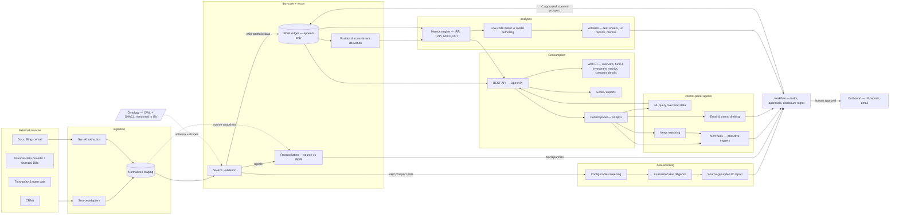

# ADR-0001: Platform Architecture — Modular Monolith with Ontology Backbone

- Status: Proposed
- Date: 2026-09-21
- Risk tier: T2 (defines cross-cutting structure; ontology and financial-data boundaries)

## Context

Mesta-Asset is a vendor-neutral private-equity investment platform that consolidates fragmented deal sourcing and multi-vendor portfolio operations into a single system. Blueprint requirements:

- One Database, One System, One Process. A single IBOR (Investment Book of Record) as the golden source for positions, commitments, and cash flows.
- A standardized investment Ontology (funds, portfolio companies, LPs, GPs) as the canonical data framework, with look-through to underlying companies.
- Multi-source ingestion: CRMs, financial and market-data providers, third-party and open-source feeds, plus gen-AI extraction from unstructured documents.
- Analytics: IRR, TVPI, MOIC, DPI, cash-flow and equity-bridge analysis; low-code authoring of new metrics, ratios, forecasts, and valuation models; artifact generation (tear sheets, LP reports, memos).
- AI-driven applications: alerting rules, natural-language query over fund data, email/memo drafting, news matching, task assignment.
- Deal sourcing: multimodal pitch-deck extraction; configurable, organization-wide screening criteria; automated stage transitions with analyst overrides; AI-assisted due diligence questionnaires; source-grounded Investment Committee reports.
- Workflow for approvals, disclosure management, and task routing.

The product's own value proposition — reducing complexity and replacing overlapping tools — rules out a microservices estate as the starting point.

## Decision

**1. Modular monolith, not microservices.** One deployable Kotlin/Spring Boot application with Gradle-enforced module boundaries:

| Module | Responsibility |
| --- | --- |
| `ibor-core` | Append-only transaction/cash-flow ledger; position, commitment, and drawdown derivation; corporate-action-equivalent events for private assets |
| `lookthrough` | Entity/instrument hierarchy (fund → deal → portfolio company → LP/GP); recursive exposure aggregation |
| `ingestion` | Per-source adapters (CRM, financial-data provider, filings, email/docs); normalization to staging; gen-AI extraction pipeline |
| `recon` | Validation and reconciliation between source systems and the IBOR; discrepancy reporting |
| `analytics` | Metrics engine (IRR/TVPI/MOIC/DPI); versioned low-code metric/model definitions; artifact rendering (Excel, PDF) |
| `deal-sourcing` | Prospect pipeline; pitch-deck screening; DDQ assistance; IC report generation; analyst review and overrides |
| `workflow` | Approvals, task assignment, disclosure-management state machines |
| `control-panel` | AI applications: alert rules, NL query, drafting, news matching |
| `api` | REST boundary (OpenAPI), auth, serving UI and external consumers |

**2. Self-hosted Supabase PostgreSQL is the single database.** Flyway migrations live in `db/migrations/`; Spring Boot remains the domain/API boundary. Supabase Auth and Storage are adopted behind controlled interfaces, while direct client writes to sensitive domain data are prohibited. See [ADR-0002](0002-self-hosted-supabase.md). Look-through and ontology workloads use TypeDB per [ADR-0003](0003-typedb-ontology-store.md); PostgreSQL remains the ledger of record.

**3. IBOR is derived, never written.** Positions, committed/invested capital, and remaining cost are computed from the append-only ledger. No mutable position tables — this is what makes the IBOR auditable and reconcilable.

**4. The Ontology lives in Git.** OWL/SHACL in `ontology/` defines the canonical model; ingestion adapters map source schemas into it; SHACL validation runs in CI and gates ingestion writes. Versioned with `owl:versionIRI`, SemVer.

**5. AI features are governed per `AGENTS.md`.** Prompts and eval sets in Git; agents act through a tool allowlist; human approval for outbound actions (emails, reports to LPs).

**6. Frontend is a separate concern.** The web UI (deal pipeline, portfolio overview, fund/investment metrics, company details, control panel) consumes `api`. Decide repo split (separate repo vs `web/` module) when scaffolding.

## End-to-end flow

## Alternatives considered

- **Commercial data and AI platform directly** — accelerates initial delivery, but introduces platform dependency and limits ownership of the Ontology, deployment model, and AI governance.
- **Microservices** — recreates the fragmentation the product eliminates; premature at this scale. Module boundaries preserve the option to extract later.
- **Graph database for look-through** (TypeDB/Neo4j) — adds a second system, violating "one database". Revisit if recursive query performance or ontology-driven inference demands it.
- **Event-sourced store (e.g. EventStoreDB)** — the ledger semantics are required, but Postgres append-only tables deliver them without new infrastructure.

## Consequences

- **Vendor neutrality is architectural, not aspirational.** No module outside `ingestion` may depend on a vendor API or format. Adapters own all vendor specifics; everything downstream sees only Ontology entities. Swapping or adding a vendor is an adapter change, never a core change.
- Every module that writes financial data (`ibor-core`, `recon`, `ingestion`, `analytics` metric defs) is T2 by default.
- Source-of-truth disputes resolve to the ledger + ontology, not to a vendor feed.
- Extracting a module into a service later requires no data migration — only a network boundary, since modules share the single database intentionally. If extraction happens, that ADR must redefine data ownership.
