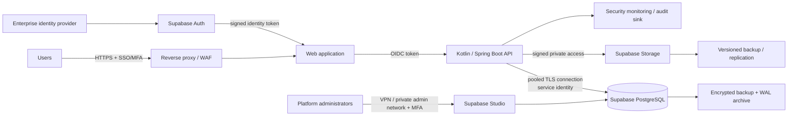

# ADR-0002: Self-Hosted Supabase Data Platform

- Status: Proposed
- Date: 2026-09-21
- Risk tier: T2 (authentication, financial data, infrastructure, backup, and recovery)
- Decision owner: Platform owner and Security
- Depends on: [ADR-0001](0001-platform-architecture.md)

## Context

Mesta-Asset handles confidential private-equity data, personal data, material non-public information, source documents, model inputs and outputs, and an append-only IBOR. Some deployments may require complete control of infrastructure, isolated operation, data residency, or restrictions that prevent use of a managed database platform.

The platform already standardizes on PostgreSQL. Self-hosted Supabase provides PostgreSQL plus optional authentication, object storage, API gateway, REST, Realtime, and administrative services while keeping data within infrastructure controlled by the operator.

Self-hosting transfers operational responsibility to Mesta-Asset. The self-hosted product does not provide managed backups or point-in-time recovery, database branching, advanced managed metrics, hosted ETL, platform management APIs, or managed high availability. It runs as a single Supabase project. The Supabase CLI local stack is for development and testing only and is not production-hardened.

## Decision

Mesta-Asset will support **self-hosted Supabase as its production data platform**, deployed from a pinned official self-hosted release using Docker Compose on hardened Linux infrastructure.

This decision does not replace the Kotlin/Spring Boot application architecture:

- Spring Boot remains the authoritative domain and API boundary.
- The application owns IBOR invariants, Ontology validation, reconciliation, workflow, authorization policy, and audit semantics.
- Flyway remains the only production schema-migration mechanism.
- Browser and external clients do not write IBOR, reconciliation, valuation, screening-decision, or approval records directly through PostgREST, Realtime, Studio, or database credentials.
- PostgreSQL Row-Level Security is defense in depth, not a replacement for application authorization.

### Service adoption

| Supabase component | Decision | Boundary |
| --- | --- | --- |
| PostgreSQL | Adopt | Canonical relational store and append-only IBOR ledger |
| Auth | Adopt conditionally | OIDC/SAML federation and required enterprise identity capabilities must be proven before production; application validates identity and enforces authorization |
| Storage | Adopt | Source documents and generated artifacts; private buckets only; metadata and permissions remain in PostgreSQL |
| PostgREST | Restrict | No direct client access to sensitive domain writes; expose only explicitly approved read models or internal integrations |
| Realtime | Defer | Enable only for a documented workflow requiring it; never treat events as the audit source of truth |
| Edge Functions | Defer | Kotlin application remains the business-logic runtime |
| Studio | Administrative only | Private network access; no public exposure; no routine production data browsing |
| Analytics/log stack | Operator choice | Must satisfy monitoring and retention requirements without logging sensitive payloads |
| Vector capability | Separate decision | AI retrieval requires an approved design covering isolation, deletion, backup, and permission-filtered retrieval |

### Environment topology

Self-hosted Supabase supports one project per stack. Development, test, staging, and production therefore run as separate deployments with separate databases, credentials, keys, storage, networks, and backups.

Studio and database administration are never exposed directly to the public internet. The reverse proxy terminates TLS and applies request limits and security policy. Database, storage, administration, and observability services remain on private networks.

## Production baseline

### Deployment

- Deployment orchestration runs through **Dokploy** (`dokploy.anterodaemon.com`) on controlled infrastructure: Compose projects per environment, TLS termination, rolling deploys, and environment isolation are managed there.
- Dokploy credentials live in the secret manager — never in Git, chat, or `.env` files committed to the repo. Use a scoped API key for automation, not the admin login.
- Pin Supabase self-hosted release tags and every container image by immutable version or digest.
- Review release notes and security advisories before upgrade.
- Store deployment configuration as reviewed infrastructure code under `infra/`; store no secret values in Git.
- Pull images through an approved registry or mirror and scan them before deployment.
- Run containers with least privilege, restricted network access, bounded resources, health checks, and restart policies.
- Expose only the reverse proxy. Do not expose PostgreSQL, Studio, Storage internals, or service dashboards publicly.
- Use the official Docker Compose self-hosting distribution initially. Kubernetes and community charts require a separate ADR and support assessment.

### Secrets and keys

- Replace all example credentials before first start.
- Generate independent secrets for each environment.
- Store database credentials, JWT signing keys, API keys, SMTP credentials, dashboard credentials, and storage secrets in the approved secret manager.
- Render runtime environment variables from the secret manager; do not maintain a production `.env` file as the system of record.
- Prefer asymmetric JWT signing keys. Document rotation and overlapping verification windows.
- Rotate service-role and administrative credentials after personnel changes, suspected exposure, and according to policy.
- Never expose service-role credentials to browsers or mobile clients.

### Database ownership

- The application connects with a non-superuser service role limited to required schemas and operations.
- Migration credentials are separate from runtime credentials and used only by the controlled deployment job.
- Supabase internal schemas remain isolated from Mesta-Asset domain schemas.
- Database triggers enforce append-only ledger restrictions where practical, complementing application invariants.
- RLS policies cover any data reachable through Supabase APIs. Policies are tested for cross-organization, cross-fund, cross-deal, and cross-document leakage.
- Production schema changes run through Flyway and the normal T2 review path; Studio is not used for ad-hoc schema mutation.

### Backup and recovery

Because managed backup and PITR are unavailable, the operator must provide:

- encrypted scheduled base backups;
- continuous WAL archiving for point-in-time recovery;
- separate, deletion-protected or immutable backup storage;
- backup coverage for PostgreSQL, Storage objects, configuration, Ontology versions, signing material needed for recovery, and audit records;
- defined retention, RPO, and RTO per environment;
- automated backup verification and regular restore drills into an isolated environment;
- documented recovery for database loss, object loss, corrupted migration, signing-key loss, and complete site loss.

A backup is not considered valid until a restore test proves data, objects, permissions, and application startup.

### Availability and scaling

Docker Compose does not itself provide database high availability. Before production launch, the deployment owner must document and test:

- expected users, ingestion throughput, storage growth, query concurrency, and reporting peaks;
- connection-pool limits and backpressure;
- database failover strategy and recovery behavior;
- storage durability and replication;
- reverse-proxy and application redundancy;
- behavior when Auth, Storage, email, or an external provider is unavailable;
- capacity thresholds and scale-up/scale-out runbooks.

Production SLO, RPO, and RTO values remain launch-blocking decisions; they must not be inferred from default Docker settings.

### Monitoring

The operator supplies monitoring beyond default container logs:

- service health, container restarts, CPU, memory, disk, network, and certificate expiry;
- database availability, connection saturation, locks, deadlocks, replication/WAL lag, checkpoint pressure, slow queries, bloat, and disk growth;
- Auth failures, privilege changes, service-role use, anomalous exports, and authorization denials;
- Storage errors, unusual downloads, object growth, and orphaned objects;
- backup completion, WAL continuity, restore-test result, and recovery-point age;
- application SLIs for latency, errors, throughput, ingestion delay, reconciliation backlog, and report generation.

Logs must be centralized, access-restricted, time-synchronized, retention-controlled, and scrubbed of tokens and sensitive payloads.

## Local development distinction

The Supabase CLI local stack may be used for development and automated integration testing. It must never be exposed as a production or internet-facing deployment. Local data is synthetic or irreversibly masked. Production deployment uses the pinned self-hosted Docker distribution and production controls in this ADR.

CLI telemetry is evaluated under developer-tool policy and disabled where required. The self-hosted Docker Compose deployment does not rely on outbound product telemetry.

## Alternatives considered

| Option | Advantages | Disadvantages | Decision |
| --- | --- | --- | --- |
| Plain self-managed PostgreSQL + object storage | Smallest service footprint; maximum control | Additional auth, storage API, and administration integration | Viable fallback; not selected for initial platform |
| Managed database/platform | Lowest operational burden; managed backup, PITR, HA, monitoring | May conflict with isolation, residency, or control requirements | Not selected for restricted deployments |
| Self-hosted Supabase with Docker Compose | Official recommended self-hosting path; integrated PostgreSQL/Auth/Storage; infrastructure control | Operator owns hardening, HA, upgrades, monitoring, backup, and recovery | Selected |
| Community Kubernetes deployment | Better orchestration and scaling primitives | Community-supported packaging; higher complexity and assurance burden | Deferred; requires separate ADR |
| Supabase CLI local stack | Fast development and testing | Not production-hardened | Development only |

## Consequences

### Positive

- Data and services remain inside controlled infrastructure.
- PostgreSQL remains the canonical store, preserving the existing architecture.
- Integrated Auth and Storage reduce custom platform code when their controls meet requirements.
- Environments can operate in isolated or restricted networks.
- Provider-specific capabilities remain behind application and infrastructure boundaries.

### Negative

- Mesta-Asset owns patching, hardening, availability, scalability, database maintenance, monitoring, backup, PITR, restore testing, and incident response.
- Self-hosted support is community-based unless a separate enterprise arrangement is established.
- Each environment requires a separate stack because self-hosting is single-project.
- Managed-platform capabilities cannot be assumed in product requirements or runbooks.
- The integrated stack increases operational and supply-chain surface compared with plain PostgreSQL.

## Production acceptance criteria

- [ ] Threat model and architecture review approved
- [ ] Pinned release and container digests recorded
- [ ] All default credentials replaced; secrets sourced from the approved secret manager
- [ ] Public exposure limited to the reverse proxy; Studio and PostgreSQL private
- [ ] SSO/MFA and token-validation design tested
- [ ] Application, migration, backup, and administrative identities separated
- [ ] RLS and application authorization isolation tests pass
- [ ] Append-only IBOR controls and audit events verified
- [ ] Encrypted base backup, continuous WAL archiving, and object backup operational
- [ ] Restore drill meets approved RPO and RTO
- [ ] Monitoring, alerting, log retention, and incident runbooks operational
- [ ] Upgrade and rollback rehearsed on staging
- [ ] Capacity and dependency-failure tests pass

## References

- [Supabase self-hosting overview](https://supabase.com/docs/guides/self-hosting)
- [Self-hosting with Docker](https://supabase.com/docs/guides/self-hosting/docker)
