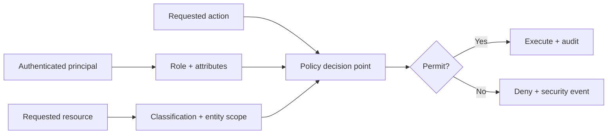
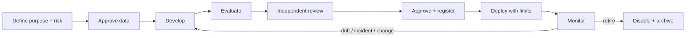
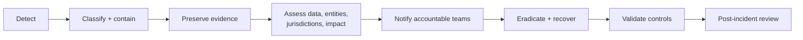

# Data Security and Governance

Security and governance requirements for Mesta-Asset. These controls apply to deal-sourcing materials, prospect and portfolio-company information, fund and LP records, financial data, personal data, model inputs and outputs, and generated artifacts.

## Objectives

1. Protect confidentiality across firms, funds, deals, portfolio companies, and LPs.
2. Preserve the integrity and lineage of IBOR, Ontology, valuation, and reporting data.
3. Keep access proportional to a user's role, entity scope, purpose, and current assignment.
4. Make every material data change, model output, override, approval, and outbound action auditable.
5. Prevent AI features from bypassing permissions, disclosure rules, or human approvals.
6. Maintain availability, recoverability, and operational continuity.

## Shared-responsibility model

| Role | Responsibility |
| --- | --- |
| Data Owner | Defines classification, approved uses, access policy, retention, and quality expectations |
| Data Steward | Maintains definitions, mappings, quality rules, lineage, and issue resolution |
| System Owner | Maintains application controls, availability, change management, and recovery |
| Security | Sets security standards; monitors threats; manages incidents, vulnerabilities, and exceptions |
| Privacy / Legal | Determines legal basis, notices, contractual restrictions, residency, retention, and data-subject obligations |
| Model Owner | Approves model purpose, training/evaluation data, thresholds, limitations, and monitoring |
| User / Analyst | Uses data for approved purposes; validates AI output; reports quality or security issues |
| Approver | Reviews high-impact outputs, overrides, disclosures, and external communications |

No person may approve their own privileged access, material data override, model promotion, or external disclosure.

## Data classification

| Class | Examples | Minimum controls |
| --- | --- | --- |
| Public | Published reports, approved marketing material, public filings | Integrity controls; approved publication process |
| Internal | Internal procedures, non-sensitive configuration, aggregate operational metrics | Authenticated access; internal sharing only |
| Confidential | Pitch decks, DDQs, company financials, fund data, contacts, valuations, investment memos | Encryption; scoped access; audit logs; controlled export and retention |
| Strictly Confidential | LP identities and commitments, personal data, material non-public information, credentials, legal investigations, deal-room material under heightened restriction | Need-to-know access; MFA; field/document restrictions; enhanced monitoring; explicit export approval; no public AI processing |

The most restrictive applicable classification follows the data into derived metrics, reports, prompts, embeddings, caches, exports, logs, and backups.

## Identity and access management

- Use enterprise SSO with OpenID Connect or SAML; require MFA for privileged and external access.
- Apply least privilege through role-based and attribute-based access control (RBAC + ABAC).
- Scope authorization by organization, fund, strategy, prospect, deal, portfolio company, LP, document, field, action, and purpose where required.
- Enforce permissions in the API and data layer. UI hiding is not an authorization control.
- Natural-language queries, search, analytics, exports, alerts, and AI retrieval inherit the caller's permissions.
- Use time-bound, approved elevation for privileged administration; prohibit shared user accounts.
- Review privileged access quarterly and all other access at least semiannually; revoke access promptly after role change or termination.
- Service identities use narrowly scoped credentials, short-lived tokens, workload identity, and rotation.
- Apply segregation of duties between data entry, reconciliation override, valuation approval, report approval, and administration.

### Authorization decision

Default is deny. A permission gap does not reveal that a restricted entity exists.

## Data lifecycle governance

Each dataset and document records:

- owner and steward;
- source system and contractual restrictions;
- classification and permitted purpose;
- legal basis where personal data is involved;
- residency and transfer constraints;
- quality rules and expected refresh frequency;
- retention period and deletion method;
- lineage to derived entities, metrics, reports, and AI outputs.

Retention is policy-driven and supports legal holds. Deletion propagates to active stores, search indexes, caches, embeddings, and scheduled backup expiration, subject to immutable audit and legal requirements.

## Encryption and secrets

- Encrypt network traffic with TLS; encrypt databases, object storage, search indexes, queues, backups, and exports at rest.
- Manage encryption keys in an approved key-management service with separation of key administration from data administration.
- Rotate keys and credentials according to policy and immediately after suspected compromise.
- Store secrets only in an approved secrets manager. Never place secrets in source code, prompts, logs, images, tickets, or documentation.
- Use signed, short-lived download links and apply expiry, recipient, and purpose constraints to sensitive exports.
- Apply field-level or application-level encryption where database-level encryption does not adequately limit privileged access.

## IBOR and Ontology integrity

- The IBOR ledger is append-only. Corrections use reversing and replacement events; historical events are not overwritten.
- Every event records source, actor, ingestion run, effective time, recorded time, currency, and correlation ID.
- Ontology schema and SHACL changes are versioned, reviewed, tested, and deployed through controlled migrations.
- Never edit a database migration or published metric definition in place; create a new version.
- Reconciliation compares source snapshots with normalized and derived records. Overrides require reason, approver, effective period, and expiry/review date.
- Reports and metrics retain input lineage and formula/model versions so prior results can be reproduced.

## Data quality governance

Quality is measured across completeness, validity, consistency, uniqueness, timeliness, accuracy, and referential integrity.

| Control point | Required behavior |
| --- | --- |
| Ingestion | Quarantine malformed or untrusted records; do not silently coerce invalid values |
| Ontology mapping | Validate required types, relationships, units, currencies, and identifiers |
| Reconciliation | Show source and IBOR values side by side; route discrepancies to accountable owners |
| Metrics | Reject incompatible units, missing valuation dates, and ambiguous gross/net conventions |
| Reporting | Display data-as-of time, stale-source warnings, and unresolved material issues |
| Overrides | Preserve original value; require reason and approval; monitor repeated overrides |

## AI and model governance

### Processing boundaries

- Treat uploaded documents, retrieved content, email, and third-party text as untrusted input.
- Never allow document instructions to modify system policy, permissions, tools, or approval requirements.
- Do not send Confidential or Strictly Confidential data to an unapproved model or public AI endpoint.
- Minimize prompt context and redact data not required for the task.
- Keep embeddings, vector indexes, caches, and model logs within the same access and residency boundary as source data.

### Grounding and output controls

- Generated claims must cite permitted Ontology entities or source-document locations.
- Mark unsupported claims as `Evidence required`; do not fabricate a completed answer.
- Preserve prompt, model, retrieval sources, output, user edits, approval, and final artifact version for material workflows.
- AI may recommend screening outcomes, DDQ answers, alerts, and report text. Humans approve declines, IC submissions, external reports, email, and material data changes.
- Prevent retrieval and generated output from exposing entities outside the caller's permission scope.

### Model lifecycle

The model registry records owner, purpose, version, provider, data sources, evaluation results, limitations, approval, deployment, and retirement. Evaluation covers extraction accuracy, citation correctness, hallucination, screening consistency, prompt injection, access-control leakage, demographic or geographic bias where relevant, drift, latency, and cost.

## Logging, audit, and monitoring

Audit events include:

- authentication, MFA, session, and authorization decisions;
- privileged actions and permission changes;
- data creation, correction, deletion, import, export, and bulk access;
- source mapping, reconciliation, override, and valuation approval;
- screening decisions and prospect stage changes;
- AI prompts, retrieval references, model versions, outputs, user edits, and approvals for material workflows;
- report generation, download, sharing, email, and LP publication;
- configuration, rule, metric, Ontology, and retention-policy changes.

Audit records are tamper-evident, access-restricted, time-synchronized, and retained according to policy. Application logs must not contain credentials, tokens, full sensitive documents, or unnecessary personal and financial data.

Alert on anomalous downloads, repeated denials, privilege escalation, impossible travel, dormant-account use, unusual query volume, bulk exports, failed reconciliation thresholds, and access to unusually sensitive entities.

## Secure engineering and change governance

- Apply threat modelling to T2 and T3 changes, especially auth, ingestion, AI tools, exports, and financial-data writes.
- Validate all input at trust boundaries; protect against injection, insecure direct object reference, server-side request forgery, malicious file uploads, and prompt injection.
- Scan source, dependencies, containers, infrastructure, and secrets in CI.
- Require peer review, CODEOWNER approval, green tests, and security review according to risk tier.
- Maintain software and model bills of materials, dependency provenance, and patch SLAs.
- Test tenant/entity isolation, authorization, audit events, backup restoration, and denial paths.
- Never use production data in development or testing unless formally approved and irreversibly masked.

## Third-party and vendor governance

Before connecting a provider or processor:

1. Document purpose, data classes, fields, locations, subprocessors, and transfer paths.
2. Complete security, privacy, resilience, legal, licensing, and concentration-risk review.
3. Define contract requirements for confidentiality, breach notification, deletion, audit, availability, and model-training restrictions.
4. Grant the minimum data and permissions needed through an isolated adapter and service identity.
5. Monitor service health, control changes, incidents, and continued business need.
6. Test replacement and exit procedures. Export data in open formats and remove provider access at termination.

No provider-specific API, identifier, or schema may escape the ingestion adapter into core modules.

## Self-hosted Supabase controls

Self-hosted Supabase is governed by [ADR-0002](adr/0002-self-hosted-supabase.md). Because self-hosting transfers managed-service responsibilities to Mesta-Asset:

- run a pinned official self-hosted release on hardened production infrastructure; the Supabase CLI local stack is development/test only;
- maintain separate stacks, keys, credentials, storage, and backups for development, test, staging, and production;
- expose only the reverse proxy publicly; keep Studio, PostgreSQL, internal Storage endpoints, and observability services on private networks;
- replace all default secrets before startup and source runtime secrets from the approved secret manager;
- separate application, migration, backup, and administrative identities;
- prohibit service-role credentials in clients and direct client writes to IBOR, valuation, reconciliation, screening-decision, approval, and audit data;
- apply and test PostgreSQL RLS to any data exposed through Supabase APIs while retaining API-layer authorization;
- provide encrypted base backups, continuous WAL archiving, point-in-time recovery procedures, object backup, immutable copies, and restore testing;
- supply monitoring, high availability, capacity management, patching, upgrades, and incident response that are not provided as managed services;
- pin and scan container images and rehearse upgrades and rollback on staging;
- maintain a complete inventory of enabled Supabase services and remove unused services to reduce attack surface.

## Resilience, backup, and recovery

- Define RTO and RPO per business process before production launch.
- Maintain encrypted, access-separated backups with immutable or deletion-protected copies where supported.
- Test restoration regularly, including database, object/document storage, Ontology versions, configuration, and audit records.
- Use idempotent ingestion and correlation IDs so interrupted jobs can restart safely.
- Document degraded operation for unavailable data providers, model services, email, and reporting integrations.
- Exercise incident response and disaster recovery with accountable business owners.

## Incident and breach response

Immediately escalate suspected credential exposure, unauthorized data access, material data corruption, cross-entity leakage, malicious AI tool use, or loss of auditability. Notification decisions and timelines are owned by Security, Privacy/Legal, and accountable business leadership.

## Minimum production gates

- [ ] Data owners, stewards, classifications, purposes, retention, and residency recorded
- [ ] SSO, MFA, RBAC/ABAC, segregation of duties, and access-review process verified
- [ ] Encryption, key management, secrets management, and credential rotation verified
- [ ] Entity-, document-, field-, query-, export-, and AI-level authorization tests pass
- [ ] IBOR append-only behavior, lineage, reconciliation, and override controls verified
- [ ] AI evaluation and prompt-injection tests meet approved thresholds
- [ ] Audit events reach monitored, tamper-evident storage without sensitive payload leakage
- [ ] Vulnerability, dependency, container, and secret scans have no unresolved High or Critical findings
- [ ] Backup restore, RTO/RPO, incident response, and provider-failure procedures tested
- [ ] Privacy/legal, security, model, and business approvals completed for the applicable risk tier
