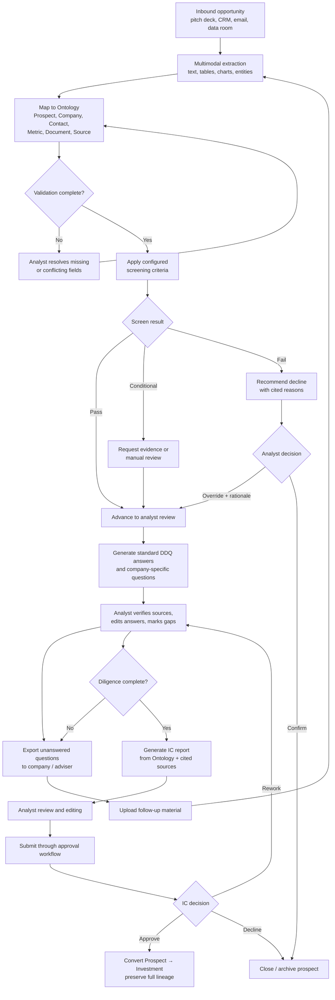

# Deal Sourcing Workflow

Standardized, AI-assisted operating model for moving an inbound opportunity from pitch deck to Investment Committee review. Configuration may differ by strategy, but stages, decision evidence, approvals, and auditability remain consistent across the firm.

## End-to-end flow



## Stage definitions

| Stage | Entry condition | System action | Human responsibility | Exit evidence |
| --- | --- | --- | --- | --- |
| Intake | Document, CRM record, or manual entry received | Deduplicate, create prospect, retain original file | Confirm ownership and confidentiality | Prospect ID and source lineage |
| Extraction | Supported file available | Extract text, tables, chart values, entities, and claims | Resolve low-confidence or conflicting fields | Valid Ontology entities with citations |
| Screening | Required fields present | Evaluate versioned criteria and recommend pass/conditional/fail | Confirm or override with rationale | Rule results and decision log |
| Due diligence | Prospect advances | Suggest preset answers and bespoke questions | Verify every answer; request missing evidence | Completed DDQ with answer-level citations |
| IC preparation | DDQ complete | Populate approved IC template from Ontology | Edit narrative, validate metrics and risks | Reviewed report and unresolved-item list |
| IC decision | Report submitted | Route approvals and record decision | Approve, decline, or request rework | Signed decision record |
| Conversion | IC approves | Convert prospect to investment without re-keying | Confirm fund/entity association | Investment linked to original prospect lineage |

## Configurable screening

Screening criteria are organization-managed, strategy-specific, versioned, and effective-dated. Example:

```text
Revenue.latest >= USD 50,000,000
Revenue.cagr(years = 5) >= 10%
Company.country IN ["Indonesia", "Singapore", "Malaysia"]
Sector NOT IN restrictedSectors
Document.pitchDeck.age <= 180 days
```

Each result includes:

- criterion version and effective date;
- normalized input value and source citation;
- pass, fail, unknown, or conflicting status;
- confidence for extracted values;
- recommended transition;
- analyst decision and override rationale.

`Unknown` never becomes `Fail` silently. It creates an evidence request or manual-review task. Automated transitions may advance low-risk internal stages, but decline, external communication, and IC submission require human confirmation.

## Due Diligence Questionnaire

### Standard questions

The organization maintains reusable question libraries by strategy, sector, geography, and deal type. Typical categories include:

- company vision and differentiation;
- market size, growth, and competitive position;
- revenue quality, customer concentration, and unit economics;
- management capability and key-person risk;
- legal, regulatory, cybersecurity, ESG, and operational risks;
- value-creation plan and principal downside scenarios.

### AI-generated questions

The model proposes bespoke questions from the prospect's materials and already generated answers. Each question must identify the claim, inconsistency, missing evidence, or risk that caused it to be proposed.

### Answer states

`Suggested → Verified → Approved`, or `Unanswered → Sent externally → Evidence received → Verified`.

A suggested answer includes answer-level citations and extraction confidence. The system must not mark AI-generated text as verified.

## Investment Committee report

The report uses an approved, versioned template populated from Ontology entities. Recommended sections:

1. Executive recommendation
2. Company and transaction overview
3. Investment thesis
4. Market and competitive landscape
5. Historical financials and forecast
6. Valuation and return scenarios
7. Due diligence findings
8. Principal risks and mitigants
9. Value-creation plan
10. Open questions and conditions precedent
11. Source appendix and decision history

Generated narrative must be grounded in cited Ontology objects or documents. Unsupported claims are omitted or visibly marked `Evidence required`. Users review and edit before export, email, or IC submission.

## Controls

- Source documents remain immutable; extracted revisions create new versions.
- Every extracted claim links to page, section, table, or bounding region in its source.
- Screening and DDQ prompts, models, criteria, and templates are versioned.
- Analysts can override recommendations, never erase them; rationale is mandatory.
- Permissions apply at prospect, document, field, and output level.
- Prompt injection in uploaded documents is treated as untrusted content and cannot alter system instructions or call tools.
- Reports and external questionnaires require human approval.
- Evaluation sets cover extraction accuracy, citation correctness, screening consistency, unsupported claims, prompt injection, and cross-document conflicts.
