# System Design

This document gathers the Mesta-Asset system design into one place: High-Level Architecture, High-Level Design, Low-Level Design, and the end-to-end architecture. The ADRs stay the source of each decision. This document shows how the decisions fit together, and each section links back to the ADR it relies on.

**Status legend** used in the tables and diagram notes:

| Mark | Meaning |
| --- | --- |
| ✅ | Implemented on `main` |
| 🟡 | Implemented in an open draft PR |
| ⬜ | Planned; tracked in [#6](https://github.com/TANTIRA/Mesta-Asset/issues/6), design not yet agreed |

Sources: [ADR-0001](adr/0001-platform-architecture.md), [ADR-0002](adr/0002-self-hosted-supabase.md), [ADR-0003](adr/0003-typedb-ontology-store.md), [AI architecture](ai-architecture.md), [decision-model integration map](decision-model-integration-map.md), [quantitative methodology](quantitative-methodology.md), [data security and governance](data-security-governance.md), `infra/docker-compose.yml`.

---

## 1. High-Level Architecture

The runtime topology. It shows one deployable application, two data stores with separate ownership, and external services reached only from the application tier.

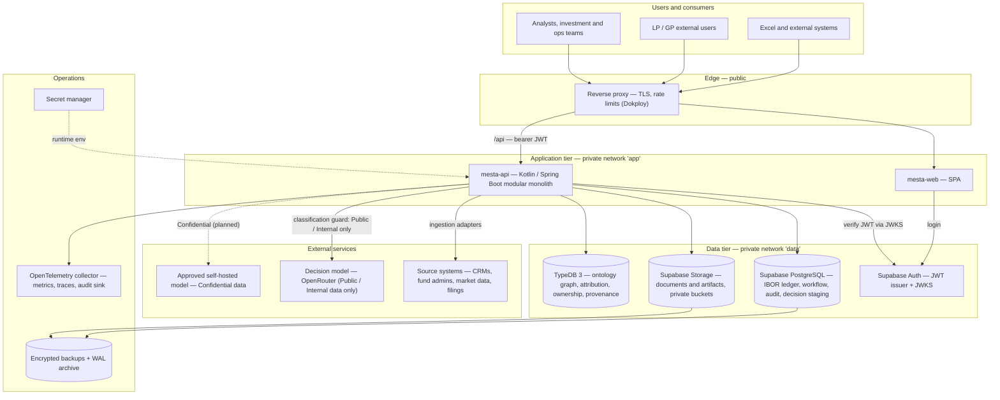

| Component | Technology | Owner | Status |
| --- | --- | --- | --- |
| `mesta-api` | Kotlin 2.2, Java 21, Spring Boot 3.5, Gradle | Mesta-Asset team | ✅ scaffold, auth boundary, migrations |
| `mesta-web` | Separate frontend image (ADR-0001 §6) | Mesta-Asset team | ⬜ |
| PostgreSQL, Auth, Storage | Self-hosted Supabase (ADR-0002) | Platform / DevOps | ✅ compose, override |
| TypeDB | TypeDB 3, schema `ontology/mesta-investment.tql` (ADR-0003) | CTO (ontology) | ✅ schema + CI validation |
| Decision model | `typesafe/jev-1.13` via OpenRouter | AI Tech Lead | ✅ client, 2 decision points |
| Backup / PITR | Operator-provided (ADR-0002) | Platform / DevOps | ⬜ runbook |

---

## 2. High-Level Design

### 2.1 Module map and dependency rules

One deployable with Gradle-enforced module boundaries. `ModuleBoundaryTest` enforces the allowed arrows below in CI. Adding an arrow means changing that test in the same PR.

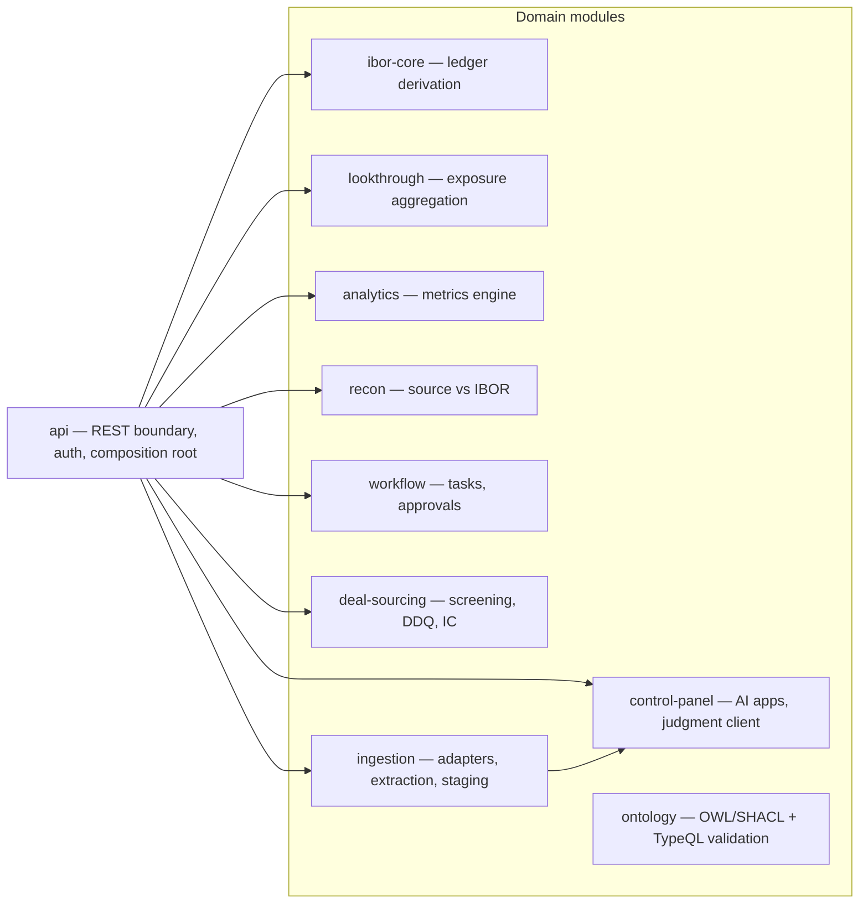

Rules:

- `api` is the only composition root, and no module depends on it.
- Domain modules are closed to each other. The only exception so far is `ingestion → control-panel`, for the judgment client. Glue between modules, such as `ibor-core` output feeding `analytics` input, lives in `api`.
- Vendor formats stay inside `ingestion` adapters (ADR-0001 consequences).

| Module | Responsibility | Tier | Status |
| --- | --- | --- | --- |
| `ibor-core` | Supersession-resolved ledger, commitment positions, investor cash flows | T2 | 🟡 [#11](https://github.com/TANTIRA/Mesta-Asset/issues/11) |
| `analytics` | DPI, RVPI, TVPI, XIRR, KS-PME, Direct Alpha, commitment status | T2 | 🟡 [#9](https://github.com/TANTIRA/Mesta-Asset/pull/9) |
| `lookthrough` | Path-sum exposure; gross, net, long and short measures | T2 | 🟡 [#10](https://github.com/TANTIRA/Mesta-Asset/pull/10) |
| `ingestion` | Document classification, claim support, append-only decision staging | T2 | ✅ |
| `control-panel` | Judgment client, data-classification guard | T2 | ✅ |
| `ontology` | SHACL validation, TypeQL ↔ OWL drift checks | T2 | ✅ |
| `api` | JWT resource server, Flyway, actuator | T2 (auth) | ✅ |
| `recon`, `workflow`, `deal-sourcing` | — | T2 | ⬜ |

### 2.2 Data ownership

Each data class has exactly one owner (ADR-0003). This is how "one source of truth" still holds with two stores.

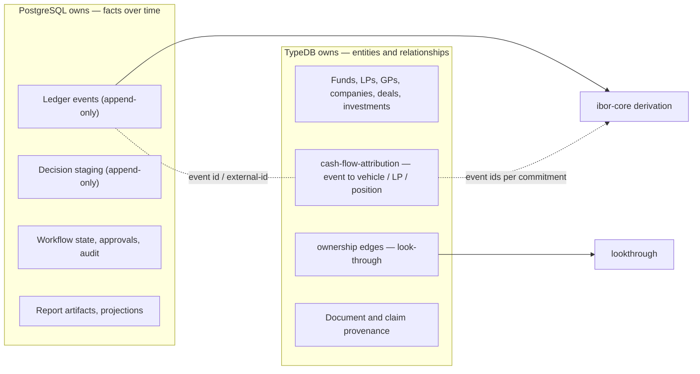

Consequence: `ibor-core` never stores attribution. The caller resolves the event ids that belong to a commitment from TypeDB and passes them to the derivation (see §3.3).

### 2.3 Capability map against the benchmarks

| Benchmark feature | Mesta-Asset capability | Module | Status |
| --- | --- | --- | --- |
| Aladdin IBOR — "one database, one system, one process" | Append-only ledger; positions derived, never written | `ibor-core` | ✅ ledger · 🟡 derivation |
| Aladdin Performance & Attribution | PE performance (§2); Brinson (§4.2) | `analytics` | 🟡 · ⬜ |
| Aladdin look-through | Path-sum exposure (§7.2) | `lookthrough` | 🟡 |
| Aladdin post-trade compliance | Rules evaluated after ledger writes → workflow tasks | `recon` + `workflow` | ⬜ |
| Aladdin reconciliation / trade matching | Source vs IBOR, graph vs ledger | `recon` | ⬜ |
| Aladdin risk (VaR/ES, factor) | Methodology §3.4, §4.1 | `analytics` | ⬜ |
| Marquee Asset service | Asset master using ontology types (owner decision on #6) | `api` + TypeDB | ⬜ |
| Marquee Data service | Bi-temporal time series (`effective_date` + `recorded_at`) | `ingestion` + `api` | ⬜ |
| Marquee Report service | Report jobs over the analytics engines | `analytics` + `workflow` + `api` | ⬜ |
| Palantir AIP workflows | Evaluated agents behind a tool allowlist | `deal-sourcing`, `control-panel` | ✅ 2 decision points · ⬜ rest |

### 2.4 Key design decisions

| # | Decision | Reason | Source |
| --- | --- | --- | --- |
| 1 | Modular monolith | Avoids rebuilding the tool fragmentation the product exists to remove | ADR-0001 §1 |
| 2 | IBOR derived, never written | Auditable and reconcilable; corrections are new rows | ADR-0001 §3, `V1__init.sql` trigger |
| 3 | Append-only tables enforced by trigger | The database, not the app, blocks UPDATE/DELETE | `V1`, `V2` migrations |
| 4 | Ledger amounts are investor-signed | Contributions negative, distributions positive (methodology §10.2) | Owner decision, #6 |
| 5 | Fees, expenses, carry and other income are outside the investor series | They stay on the position report and out of IRR and multiples | Owner decision, #6 |
| 6 | Undefined metric results are `null`, never 0 | Methodology §10.7 | #9 |
| 7 | Attribution lives in TypeDB | One owner per data class | ADR-0003 |
| 8 | Confidential data never reaches a public model | `DataClassification.mayLeavePlatform` guard | AGENTS.md, `control-panel` |
| 9 | Self-hosted Supabase; backups and PITR are the operator's job | Data residency and control | ADR-0002 |

### 2.5 Security boundary

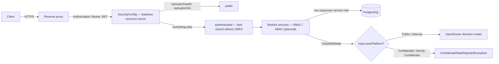

---

## 3. Low-Level Design

### 3.1 PostgreSQL schema (`mesta`)

Tables created by the migrations that already exist. Every table rejects UPDATE and DELETE with a trigger, and every row carries provenance.

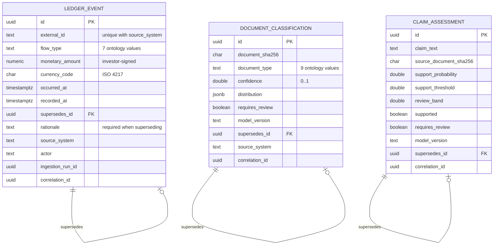

Invariants enforced in the database:

- `flow_type` and `document_type` check constraints mirror the ontology `@values`. Drift tests in `ingestion` and `ibor-core` fail CI if the two diverge.
- A superseding row must carry a rationale and cannot supersede itself.
- `(source_system, external_id)` is unique, so a replayed source record cannot be inserted twice.

### 3.2 Ledger event lifecycle

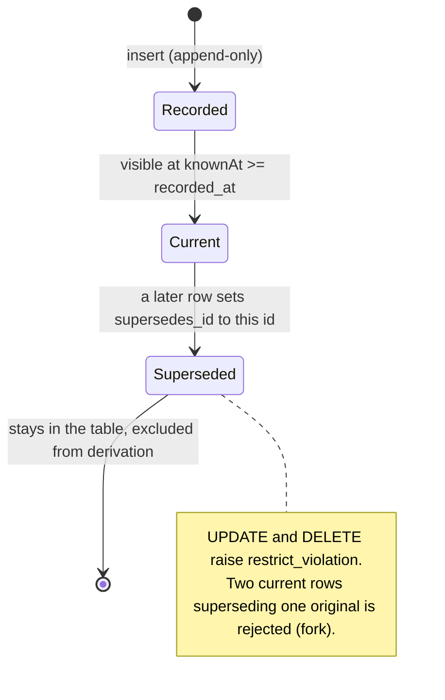

### 3.3 `ibor-core` 🟡

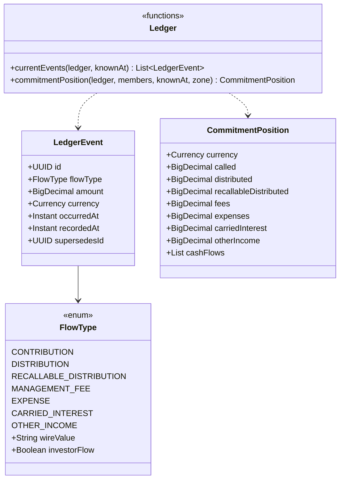

Derivation algorithm:

1. **Bi-temporal cut.** Keep only events with `recordedAt <= knownAt`.
2. **Resolve supersession over the whole ledger.** Any event targeted by a kept event is dropped. A missing target, or two events targeting the same original, is an error.
3. **Filter to `members`.** These are the event ids attributed to the commitment in TypeDB. A correction that moves an event to another commitment therefore removes it from this one.
4. **Aggregate.** Take a positive total per flow type. The single-currency check fails loudly on mixed currencies.
5. **Build the investor series.** Keep only flow types with `investorFlow = true`. Date each flow in the zone the caller passes, then sort.

### 3.4 `analytics` 🟡

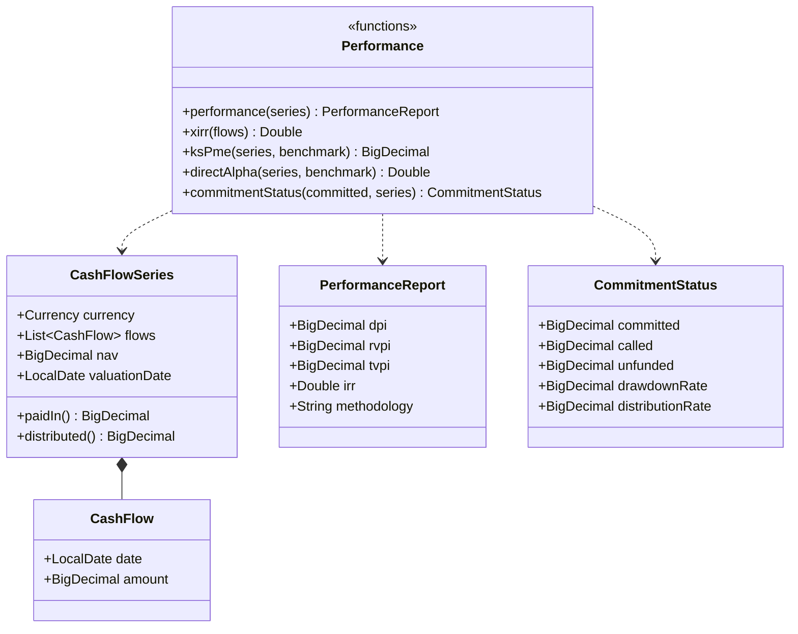

- **XIRR.** Uses actual/365. The NPV is scanned on a 401-point grid over (−99%, +10,000%); the result is defined only if the NPV crosses zero exactly once, and is then refined by bisection. Several roots give `null`.
- **Guards.** Cash flows after `valuationDate` are rejected, and NAV must not be negative. A zero denominator returns `null`.

### 3.5 `lookthrough` 🟡

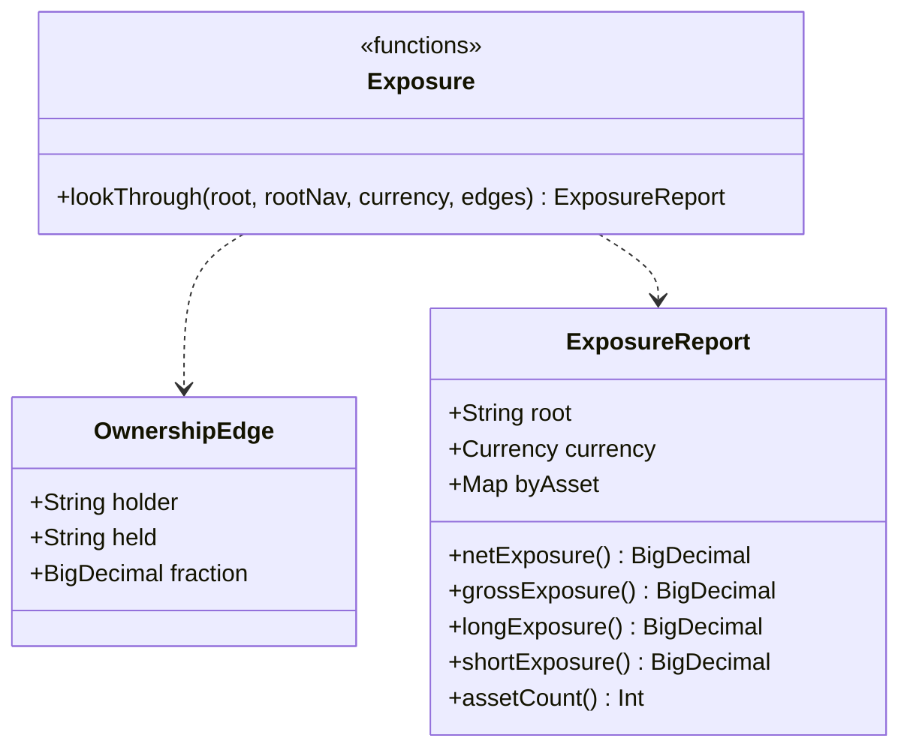

The function walks depth-first from the root, multiplying ownership fractions, and adds the result at each leaf. Because every path is summed, a company held through two funds is counted through both. A node already on the current path raises a cycle error.

### 3.6 AI decision points (`control-panel` + `ingestion`) ✅

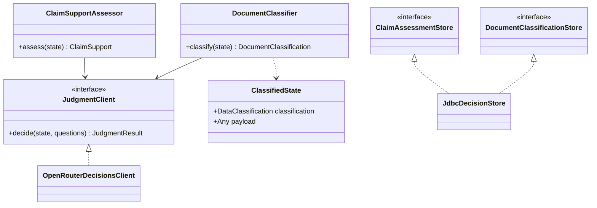

### 3.7 Planned contracts ⬜

These are proposals only. Per CLAUDE.md, each needs its plan agreed on #6 before any code is written, and none of these endpoints exist yet.

| Slice | Surface | Shape, following the Marquee reference |
| --- | --- | --- |
| 4b | `JdbcLedgerReader` + `api` glue | `CommitmentPosition` → `CashFlowSeries` → `performance()` |
| 5 | Asset master | Types limited to ontology entities; identifiers held as xrefs |
| 6 | Time-series data | Query by dataset, date range, fields, `asOfTime`, `since`; bi-temporal, append-only |
| 7 | Report jobs | Type, position source, measures; status `new → executing → done / error` |

---

## 4. End-to-End Architecture

### 4.1 System flow

Source data to governed output. Every write passes validation, and every outbound artifact passes a human approval gate.

```mermaid
flowchart LR
  subgraph IN["Ingest"]
    S1["Structured sources"] --> AD["Adapters"]
    S2["Documents"] --> CL["Classify + extract (decision model)"]
    AD --> STG[("Staging")]
    CL --> DST[("Decision staging")]
  end

  subgraph GOV["Validate"]
    SH["SHACL + ontology checks"]
    RV["Human review queue"]
  end

  subgraph REC["Record"]
    LED[("Ledger — PostgreSQL")]
    GR[("Graph — TypeDB")]
  end

  subgraph DER["Derive"]
    POS["ibor-core — positions, investor flows"]
    PERF["analytics — DPI / TVPI / IRR / PME"]
    EXP["lookthrough — exposure"]
  end

  subgraph OUT["Serve"]
    APIX["REST API"]
    UIX["Web UI / Excel"]
    RPT["Reports and LP artifacts"]
    APR["Approval gate"]
  end

  STG --> SH
  DST -->|"requires_review"| RV
  RV --> SH
  SH -->|"facts"| LED
  SH -->|"entities, attribution, ownership"| GR
  LED --> POS
  GR -->|"event ids per commitment"| POS
  POS --> PERF
  GR -->|"ownership edges"| EXP
  PERF & EXP --> APIX --> UIX
  PERF & EXP --> RPT --> APR -->|"approved"| DIST["LPs / external recipients"]
  SH -->|"rejects, breaks"| RC["recon → workflow tasks"]
```

### 4.2 Sequence: from ledger to fund performance (slices 4a + 4b + 1)

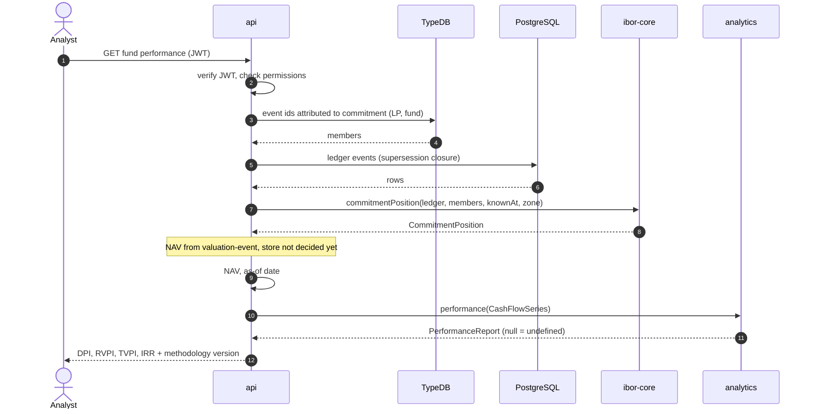

### 4.3 Sequence: document ingestion decision (implemented)

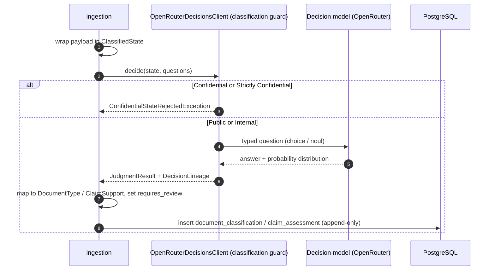

### 4.4 Sequence: deal sourcing to portfolio (planned)

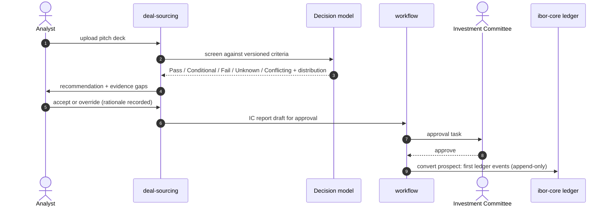

### 4.5 Delivery pipeline

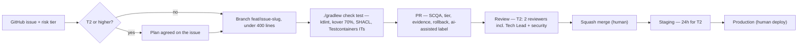

Agents never merge, deploy, or push to `main` (AGENTS.md).
