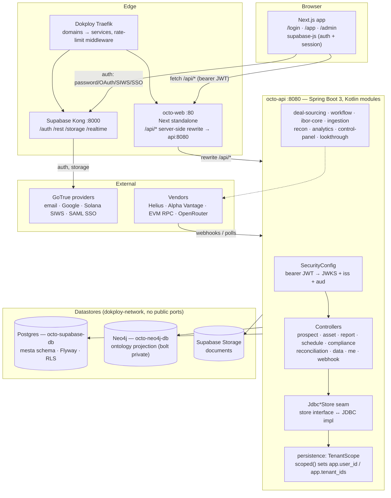
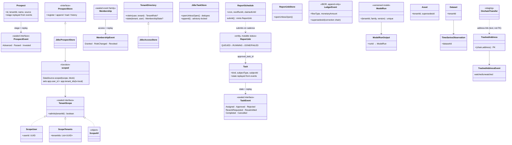

# System map — generated from the code

Three views of the same system, derived from the code itself on 2026-09-27
(main @ `e5957086`): `db/migrations/*.sql` is the ERD's source,
`modules/*/src/main/kotlin` the class diagram's, and
`infra/` + `deploy/` + `web/` the architecture's. These diagrams document; the
code decides — regenerate after schema or module changes rather than editing by hand.

## 1. High-level architecture



Request path: the browser talks to exactly two origins — the Next app (which
server-side rewrites `/api/*` to the internal api, so the API never sits on the
public origin) and Kong for Supabase auth. The api verifies the JWT against
GoTrue's JWKS, resolves tenant membership (`TenantDirectory` → `tenant_member`
replay), opens a transaction under `TenantScope`, and every store query runs
inside it — V27's RLS policies read the same GUCs, so an unscoped call fails
closed at the database too.

## 2. Domain model — the event-sourced shape every module repeats



The recurring contract: an **immutable header** row plus an **append-only event
table**, state derived by replay (`prospect`, `tenant_member`, `workflow_task`,
`tracked_address`, `model_run`, ledger `supersedes_id` chains). Mutable columns
are the exception (`report_job.status`, `report_schedule.*` cadence fields) and
are the ones the domain can't replay. Every store call passes through
`DataSource.scoped`, which is what makes the V27 RLS policies see the scope.

## 3. Entity-relationship diagram — mesta schema, V1–V27

Append-only tables carry `supersedes_id`; `reject_mutation` triggers refuse
UPDATE/DELETE on them. `tenant_id` marks RLS-governed rows (V27); tables
without it (`workflow_task*`, `audit_event`, `instrument*`, `ledger_event`,
staging) are edge-gated today — their tenant columns are the follow-up slice.

```mermaid
erDiagram
    ASSET ||--o{ ASSET : "supersedes"
    ASSET ||--o{ ASSET_XREF : "asset_id"
    CLAIM_ASSESSMENT ||--o{ CLAIM_ASSESSMENT : "supersedes"
    DATASET ||--o{ TIMESERIES_OBSERVATION : "dataset_id"
    DOCUMENT_CLASSIFICATION ||--o{ DOCUMENT_CLASSIFICATION : "supersedes"
    INSTRUMENT ||--o{ INSTRUMENT_FLOW : "instrument_id"
    INSTRUMENT_FLOW ||--o{ INSTRUMENT_FLOW : "supersedes"
    LEDGER_EVENT ||--o{ LEDGER_EVENT : "supersedes"
    LEDGER_EVENT ||--o{ RECONCILIATION_BREAK : "ledger_event_id"
    MODEL_RUN ||--o{ MODEL_RUN : "supersedes"
    MODEL_RUN ||--o{ MODEL_RUN_OUTPUT : "run_id"
    ONCHAIN_BALANCE_SNAPSHOT ||--o{ ONCHAIN_BALANCE_SNAPSHOT : "supersedes"
    ONCHAIN_CLAIM_EVIDENCE ||--o{ ONCHAIN_CLAIM_EVIDENCE : "supersedes"
    ONCHAIN_TRANSFER ||--o{ ONCHAIN_TRANSFER : "supersedes"
    PROSPECT ||--o{ PROSPECT_EVENT : "prospect_id"
    TENANT ||--o{ ASSET : "owns"
    TENANT ||--o{ COMPLIANCE_EVALUATION : "owns"
    TENANT ||--o{ COMPLIANCE_RULE : "owns"
    TENANT ||--o{ DATASET : "owns"
    TENANT ||--o{ MODEL_RUN : "owns"
    TENANT ||--o{ PROSPECT : "owns"
    TENANT ||--o{ RECONCILIATION_BREAK : "owns"
    TENANT ||--o{ REPORT_JOB : "owns"
    TENANT ||--o{ REPORT_SCHEDULE : "owns"
    TENANT ||--o{ SCREENING_RULE : "owns"
    TENANT ||--o{ TENANT_MEMBER : "owns"
    TENANT ||--o{ TRACKED_ADDRESS : "owns"
    TENANT_MEMBER ||--o{ TENANT_MEMBER_EVENT : "membership"
    TIMESERIES_OBSERVATION ||--o{ TIMESERIES_OBSERVATION : "supersedes"
    TRACKED_ADDRESS ||--o{ TRACKED_ADDRESS_EVENT : "address"
    TRACKED_ADDRESS ||--o{ TRACKED_ADDRESS_EVENT : "chain"
    VALUATION_EVENT ||--o{ VALUATION_EVENT : "supersedes"
    WORKFLOW_TASK ||--o{ COMPLIANCE_EVALUATION : "task_id"
    WORKFLOW_TASK ||--o{ RECONCILIATION_BREAK : "task_id"
    WORKFLOW_TASK ||--o{ REPORT_JOB : "approval_task_id"
    WORKFLOW_TASK ||--o{ WORKFLOW_TASK_EVENT : "task_id"

    ASSET {
        uuid id PK
        uuid tenant_id FK
        text asset_type 
        text asset_class 
        text display_name 
        char2 region 
        text_arr tags 
        text graph_node_id
        uuid supersedes_id FK
        text rationale 
        text source_system 
        text actor 
        uuid correlation_id 
        tstz recorded_at 
    }
    ASSET_XREF {
        uuid id PK
        uuid asset_id FK
        text scheme 
        text value 
        tstz recorded_at 
    }
    AUDIT_EVENT {
        bigint seq PK
        tstz occurred_at 
        tstz recorded_at 
        text actor 
        text action 
        text subject_type 
        text subject_id 
        uuid correlation_id 
        jsonb details 
        bytea prev_hash 
        bytea hash 
    }
    CLAIM_ASSESSMENT {
        uuid id PK
        text external_id 
        text claim_text 
        char64 source_document_sha256 
        float8 support_probability 
        float8 support_threshold 
        float8 review_band 
        boolean supported 
        boolean requires_review 
        text model_provider 
        text model_version 
        text decision_request_id 
        tstz recorded_at 
        uuid supersedes_id FK
        text rationale 
        text source_system 
        text actor 
        uuid ingestion_run_id 
        uuid correlation_id 
    }
    COMPLIANCE_EVALUATION {
        uuid id PK
        uuid tenant_id FK
        text rule_id 
        integer rule_version 
        text subject 
        date as_of_date 
        text result 
        jsonb measured 
        text explanation 
        uuid task_id FK
        uuid correlation_id 
        tstz recorded_at 
    }
    COMPLIANCE_RULE {
        uuid id PK
        uuid tenant_id FK
        text rule_id 
        integer version 
        text name 
        jsonb definition 
        boolean active 
        text actor 
        uuid correlation_id 
        tstz recorded_at 
    }
    DATASET {
        uuid id PK
        uuid tenant_id FK
        text name 
        text description 
        text unit 
        char3 currency_code 
        text source_system 
        text actor 
        uuid correlation_id 
        tstz recorded_at 
    }
    DOCUMENT_CLASSIFICATION {
        uuid id PK
        text external_id 
        char64 document_sha256 
        text document_type 
        float8 confidence 
        jsonb distribution 
        boolean requires_review 
        text model_provider 
        text model_version 
        text decision_request_id 
        tstz recorded_at 
        uuid supersedes_id FK
        text rationale 
        text source_system 
        text actor 
        uuid ingestion_run_id 
        uuid correlation_id 
    }
    INSTRUMENT {
        uuid id PK
        text external_key 
        text chain 
        text mint_address 
        text instrument_kind 
        smallint decimals 
        text symbol 
        tstz recorded_at 
        text source_system 
        text actor 
        uuid ingestion_run_id 
        uuid correlation_id 
    }
    INSTRUMENT_FLOW {
        uuid id PK
        text external_id 
        uuid instrument_id FK
        text chain 
        text wallet 
        text token_account 
        text flow_type 
        numeric amount_raw 
        smallint decimals 
        tstz occurred_at 
        tstz recorded_at 
        bigint slot 
        text signature 
        uuid supersedes_id FK
        text rationale 
        text source_system 
        text actor 
        uuid ingestion_run_id 
        uuid correlation_id 
    }
    LEDGER_EVENT {
        uuid id PK
        text external_id 
        text flow_type 
        numeric monetary_amount 
        char3 currency_code 
        tstz occurred_at 
        tstz recorded_at 
        uuid supersedes_id FK
        text rationale 
        text source_system 
        text actor 
        uuid ingestion_run_id 
        uuid correlation_id 
    }
    MODEL_RUN {
        uuid id PK
        uuid tenant_id FK
        text model_family 
        text model_version 
        text methodology 
        jsonb state_definitions 
        jsonb feature_set 
        text frequency 
        date data_vintage 
        date training_start 
        date training_end 
        date validation_start 
        date validation_end 
        jsonb parameters 
        jsonb diagnostics 
        text status 
        uuid supersedes_id FK
        text rationale 
        text actor 
        uuid correlation_id 
        tstz recorded_at 
    }
    MODEL_RUN_OUTPUT {
        uuid id PK
        uuid run_id FK
        date as_of_date 
        text kind 
        jsonb values 
    }
    ONCHAIN_BALANCE_SNAPSHOT {
        uuid id PK
        text external_id 
        tstz as_of 
        text chain 
        text wallet 
        text token_account 
        text mint_address 
        numeric amount_raw 
        smallint decimals 
        numeric usd_value 
        text source 
        bigint slot 
        tstz recorded_at 
        uuid supersedes_id FK
        text rationale 
        text source_system 
        text actor 
        uuid ingestion_run_id 
        uuid correlation_id 
    }
    ONCHAIN_CLAIM_EVIDENCE {
        uuid id PK
        text external_id 
        text claim_ref 
        text chain 
        text subject_address 
        text evidence_kind 
        numeric observed_numeric 
        text observed_text 
        jsonb observed_payload 
        tstz as_of 
        tstz recorded_at 
        uuid supersedes_id FK
        text rationale 
        text source_system 
        text actor 
        uuid ingestion_run_id 
        uuid correlation_id 
    }
    ONCHAIN_TRANSFER {
        uuid id PK
        text external_id 
        text chain 
        text signature 
        bigint slot 
        text block_hash 
        tstz block_time 
        text commitment 
        text wallet 
        text counterparty 
        text token_account 
        text mint_address 
        numeric amount_raw 
        smallint decimals 
        text direction 
        text transfer_kind 
        jsonb helius_payload 
        tstz recorded_at 
        uuid supersedes_id FK
        text rationale 
        text source_system 
        text actor 
        uuid ingestion_run_id 
        uuid correlation_id 
    }
    PROSPECT {
        uuid id PK
        uuid tenant_id FK
        text name 
        text source 
        text sector 
        text region 
        text description 
        tstz registered_at 
        text source_system 
        text actor 
        uuid correlation_id 
        tstz recorded_at 
    }
    PROSPECT_EVENT {
        uuid id PK
        bigint seq 
        uuid prospect_id FK
        text event_type 
        text stage_from 
        text stage_to 
        text actor 
        text rationale 
        tstz occurred_at 
        tstz recorded_at 
        uuid correlation_id 
    }
    RECONCILIATION_BREAK {
        uuid id PK
        uuid tenant_id FK
        uuid run_id 
        text kind 
        text source_system 
        text source_ref 
        uuid ledger_event_id FK
        jsonb detail 
        uuid task_id FK
        uuid correlation_id 
        tstz recorded_at 
    }
    REPORT_JOB {
        uuid id PK
        uuid tenant_id FK
        text report_type 
        text position_source_type 
        text position_source_id 
        text_arr measures 
        jsonb parameters 
        text status 
        text requested_by 
        jsonb result 
        text error 
        text artifact_sha256 
        uuid approval_task_id FK
        uuid correlation_id 
        tstz created_at 
        tstz updated_at 
    }
    REPORT_SCHEDULE {
        uuid id PK
        uuid tenant_id FK
        text name 
        text report_type 
        text position_source_type 
        text position_source_id 
        text_arr measures 
        jsonb parameters 
        text cron 
        tstz next_run_at 
        boolean active 
        tstz claimed_until 
        tstz created_at 
        tstz updated_at 
    }
    SCREENING_RULE {
        uuid id PK
        uuid tenant_id FK
        text rule_id 
        integer version 
        text name 
        jsonb criteria 
        boolean active 
        text actor 
        uuid correlation_id 
        tstz recorded_at 
    }
    TENANT {
        uuid id PK
        text slug 
        text display_name 
        tstz created_at 
        text source_system 
        uuid correlation_id 
    }
    TENANT_MEMBER {
        uuid tenant_id PK FK
        uuid user_id PK
        tstz created_at 
        text source_system 
        uuid correlation_id 
    }
    TENANT_MEMBER_EVENT {
        uuid id PK
        bigint seq 
        uuid tenant_id FK
        uuid user_id FK
        text event_type 
        text role 
        text actor 
        text rationale 
        tstz occurred_at 
        uuid correlation_id 
    }
    TIMESERIES_OBSERVATION {
        uuid id PK
        uuid dataset_id FK
        text series_key 
        text field 
        date effective_date 
        numeric value 
        tstz recorded_at 
        uuid supersedes_id FK
        text rationale 
        text source_system 
        text actor 
        uuid ingestion_run_id 
        uuid correlation_id 
    }
    TRACKED_ADDRESS {
        text chain PK
        text address PK
        uuid tenant_id FK
        text label 
        tstz recorded_at 
        text source_system 
        uuid correlation_id 
    }
    TRACKED_ADDRESS_EVENT {
        uuid id PK
        bigint seq 
        text chain FK
        text address FK
        text event_type 
        text actor 
        text rationale 
        tstz occurred_at 
        uuid correlation_id 
    }
    VALUATION_EVENT {
        uuid id PK
        text external_id 
        numeric monetary_amount 
        char3 currency_code 
        date as_of_date 
        text valuation_method 
        tstz recorded_at 
        uuid supersedes_id FK
        text rationale 
        text source_system 
        text actor 
        uuid ingestion_run_id 
        uuid correlation_id 
    }
    WORKFLOW_TASK {
        uuid id PK
        text kind 
        text subject_type 
        text subject_id 
        text requested_by 
        tstz created_at 
        text source_system 
        uuid correlation_id 
    }
    WORKFLOW_TASK_EVENT {
        uuid id PK
        uuid task_id FK
        text event_type 
        text actor 
        text assignee 
        text rationale 
        tstz occurred_at 
        tstz recorded_at 
        uuid correlation_id 
    }
```
