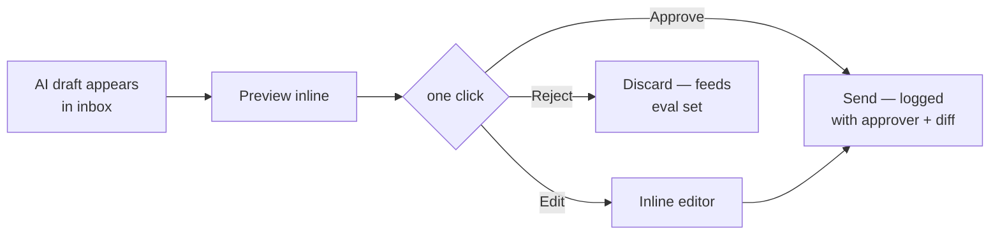

# User Experience

Experience principles and interaction patterns for Mesta-Asset. Built on [user-workflows.md](user-workflows.md) (tasks) and [user-journey.md](user-journey.md) (adoption over time).

## Principles

| Principle | What it means in practice |
| --- | --- |
| **One place to start** | The Control Panel is the morning surface — alerts, drafts, news, tasks. Nobody hunts across tools to learn what changed overnight. |
| **Every number defends itself** | Any metric, chart point, or table cell traces to ledger entries and source documents. Trust is a feature, not a hope. |
| **AI proposes, humans dispose** | Drafts, alerts, and suggestions are always editable and never self-execute. Approval is one click; rejection is cheap. |
| **Drill, don't navigate** | Moving from portfolio → fund → deal → company is a click on the thing you're looking at, not a search or a new filter set. |
| **The system shows its work** | Recon discrepancies, rule triggers, and overrides are visible and explained. No silent data changes. |
| **Fewer panels, more focus** | Each screen answers one class of question. Depth comes from drilling, not from cramming every chart onto one page. |

## Signature interactions

### The inbox that isn't email

The Control Panel inbox mixes triggered rules, drafted replies, news matches, and tasks in one feed — typed by icon, filterable by keyword/type, deep-linking to the affected entity. Clearing it means the portfolio is understood, not that messages were archived.

### Drill-down with memory

Row-click descends a level and preserves context: filters applied at Investment Metrics carry into Company Details; breadcrumbs show the entity path (`Portfolio → US Manufacturing III → FN NYC`). Back-navigation restores exact scroll and filter state.

### Query bar everywhere

Natural-language query is a persistent affordance, not a separate page. Answers render inline as chart/table plus cited entities; each cited entity links into the correct tab with filters pre-applied. Queries are permission-scoped — the answer can never leak an entity the user can't see.

### Draft-and-approve loop

The approve action records who approved, what changed vs the draft, and when. Rejection is equally valuable — it trains the eval set.

### Discrepancy resolution

Recon queue rows show source value vs IBOR value side by side, with the mapping rule that produced the discrepancy. Resolution options are explicit and audited: fix mapping → correct at source → accept IBOR (reason required). No "ignore" — silence is how discrepancies multiply.

### Lineage tracing

Every metric has a "why" affordance: hover/click reveals the computation — formula, input entities, ledger entries, source documents. This is the antidote to "which spreadsheet is right?" — the platform answers it mechanically.

## Screen-level experience notes

| Screen | Experience intent |
| --- | --- |
| Portfolio Overview | Five-second answer: "how is the portfolio doing?" KPI band first, waterfall and cash-flow below, table last. |
| Fund Metrics | Comparison surface — sectors and funds side by side. Equity bridge tells the story of value creation per fund. |
| Investment Metrics | Filter-first — the rail scopes everything; deal source and status are the natural mental axes. |
| Company Details | Dossier feel — left rail identity + contacts, right side evidence (metrics, hiring trends). Export is one click because analysts live in Excel. |
| Control Panel | Triage feel — like an inbox, not a dashboard. Every item has one obvious action. |

## States and failure handling

- **Stale data is labeled, not hidden.** A chart fed by a source that failed last night's refresh shows its data age ("as of Jul 14"). Wrong numbers are worse than old numbers.
- **Empty states teach.** A cleared inbox says "no open alerts — add a rule" with a link to rule authoring, not a blank panel.
- **Validation failures are readable.** SHACL rejections translate to "Financial-data feed: Fund 'X' missing inception date" — not a stack trace.
- **Permission gaps are invisible.** Entities a user can't see don't appear as locked tiles; they simply don't exist in that user's view.

## Consistency rules

- Numbers: currency in compact form ($1.67B, $383M) in bands/charts; full precision in tables and exports.
- Metrics: IRR percentages to two decimals; TVPI/MOIC as multiples (1.389, not 138.9%).
- Statuses are binary where the domain allows — Realized/Unrealized — not a rainbow of states.
- Every destructive or outbound action names its approver. Every AI artifact shows "drafted by AI" provenance.
