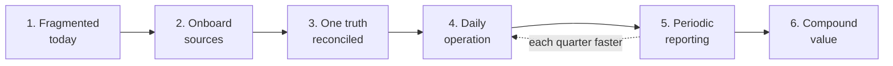
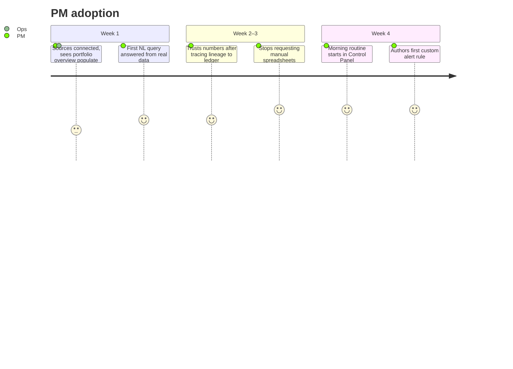

# User Journey

How a firm adopts and operates Mesta-Asset, from first contact to steady state. Complements [user-workflows.md](user-workflows.md) (task-level flows) — this file covers the journey over time.

## Adoption arc

| Stage | What happens | Pain removed | First-value signal |
| --- | --- | --- | --- |
| 1. Fragmented today | Same process repeated across locations; overlapping tools; no central view | — | Baseline: count the tools, people, and hours spent assembling one portfolio view |
| 2. Onboard sources | Connect CRMs, financial-data providers, fund administrator exports, and document stores; map each to the Ontology; adapters configured | "Which spreadsheet is right?" | Sources land in staging; SHACL validation passes |
| 3. One truth reconciled | IBOR ledger populated; recon surfaces discrepancies; ops resolves them in queue | Data discrepancies between vendors | Recon queue trends to zero; every metric traces to ledger lineage |
| 4. Daily operation | Control Panel inbox is the morning start: alerts, drafted replies, news. Drill portfolio → fund → deal → company | "Multiple eyes on a single source of data" | Days since last manually assembled report |
| 5. Periodic reporting | LP reports and tear sheets generated, reviewed, approved, published | Reporting cycles that took weeks | Quarter-end pack produced in hours |
| 6. Compound value | Custom metrics authored in low-code; alert rules accumulate; AI drafts improve from eval feedback | Rigidity — models locked to vendor release cycles | Firm-specific metrics live; rules fire before humans notice issues |

## Journey by persona

### Portfolio Manager — first month

- **Touchpoints:** Portfolio Overview → Fund Metrics → Control Panel query bar → alert rules
- **Emotional arc:** skepticism ("another dashboard") → verification (lineage tracing) → reliance (starts day in Control Panel)
- **Moment of truth:** asks a question in NL, gets an answer with cited entities, verifies it against the ledger — and it's right

### Investment Analyst — quarterly cycle

- **Quarter start:** reviews Control Panel alerts on portfolio companies; triages news matches flagged for holdings
- **Mid-quarter:** monitors company details — financial metrics, hiring trends; drafts IC memos with AI assistance, edits in place
- **Quarter end:** valuations updated in ledger; runs equity-bridge analysis; contributes to LP pack via workflow
- **Touchpoints:** Company Details → Control Panel drafts → workflow approvals

### Operations — continuous

- **Onboard:** each new vendor/fund source = adapter config + mapping + first recon pass (WF-3)
- **Steady state:** recon queue is their inbox; discrepancies resolved by fixing mappings, pushing corrections to source owners, or recording audited overrides
- **Touchpoints:** ingestion status, recon queue, workflow tasks

### IR / LP Relations — quarterly

- **T-2 weeks:** generates LP reports and tear sheets; reviews AI-drafted commentary; edits inline
- **T-1 week:** submits through approval workflow; approver sign-off
- **T-0:** publishes to LP portal/email; answers LP questions via NL query instead of chasing analysts
- **Touchpoints:** analytics artifacts → workflow → outbound

### CFO / Oversight — oversight loop

- **Weekly:** look-through exposure review; Control Panel summary of fired rules
- **Exception:** approves/rejects outbound artifacts; reviews audited overrides in recon log
- **Touchpoints:** Control Panel → look-through views → approval queue

## What changes for the firm

| Before | After |
| --- | --- |
| Same process run by multiple people in multiple locations | One process, one system, one database |
| Overlapping tools with discrepant numbers | Single source of truth; discrepancies surface as recon tasks |
| Vendor tools dictate the data model | Firm's Ontology is canonical; vendors are interchangeable adapters |
| Reports assembled by hand per quarter | Artifacts generated, reviewed, approved |
| Alerts live in inboxes and heads | Rules fire into the Control Panel; nothing depends on one person remembering |
