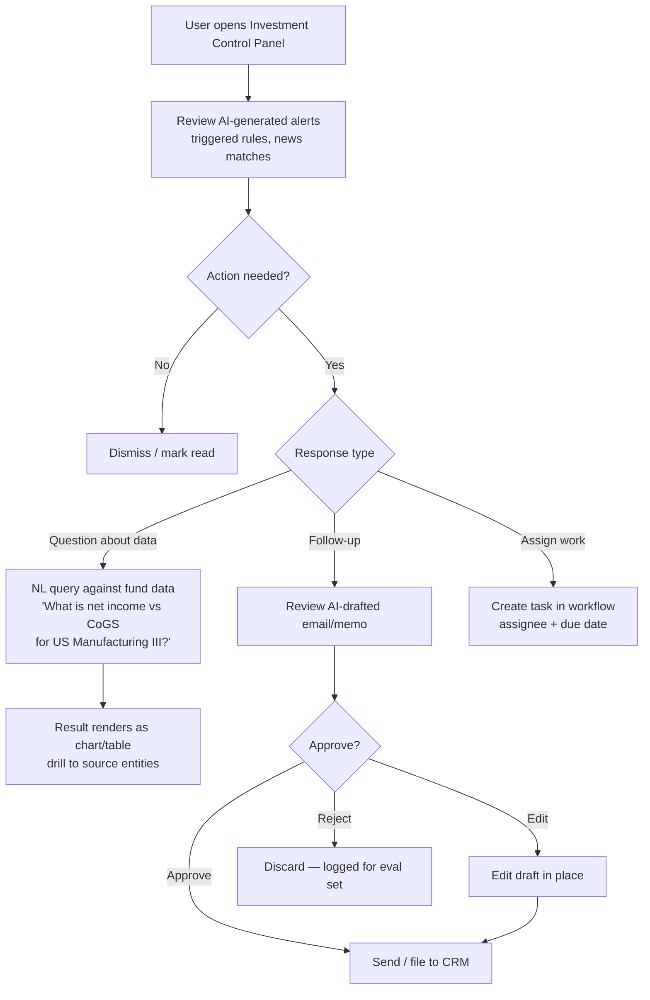
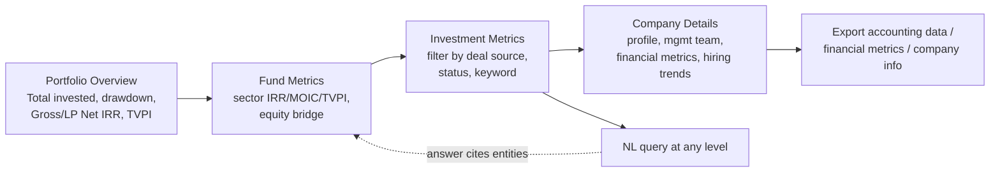
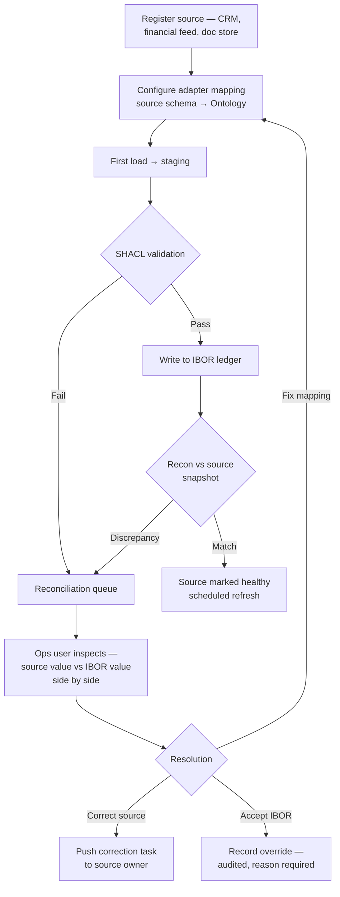
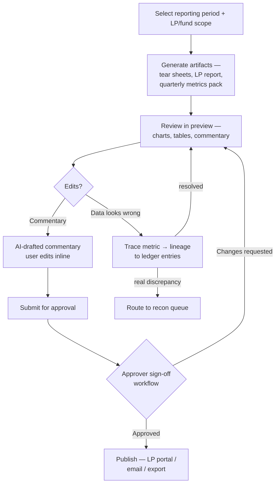
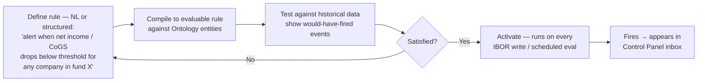
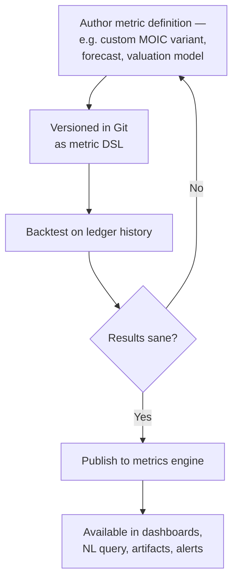
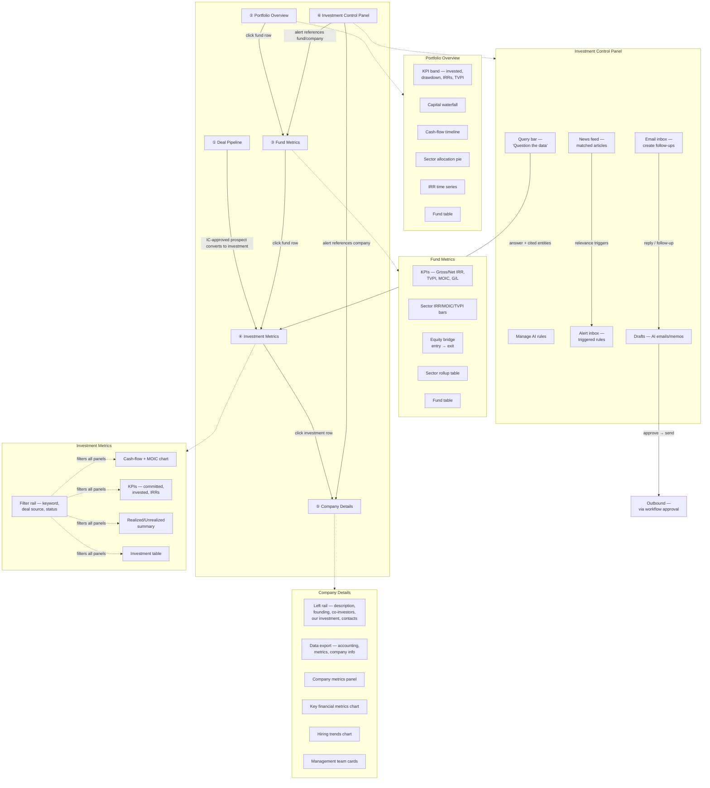

# User Workflows

End-to-end operating workflows for Mesta-Asset, derived from the platform blueprint and reference screens (Portfolio Overview, Fund Metrics, Investment Metrics, Company Details, Investment Control Panel).

## Personas

| Persona | Uses the platform to |
| --- | --- |
| **Sourcing / Research Analyst** | Screen inbound opportunities, complete diligence, and prepare source-grounded IC reports |
| **Portfolio Manager (PM)** | Monitor portfolio performance, drill from fund to deal to company, answer ad-hoc questions |
| **Investment Analyst** | Review portfolio-company financials, track hiring/operating metrics, write memos |
| **Operations** | Onboard data sources, resolve reconciliation discrepancies, manage data quality |
| **IR / LP Relations** | Produce LP reports and tear sheets, respond to LP requests |
| **CFO / Oversight** | Look-through exposure, control-panel oversight, approve outbound artifacts |

## WF-1 — Daily monitoring (Control Panel first)

## WF-2 — Portfolio drill-down (overview → deal → company)

## WF-3 — Data onboarding (Operations)

## WF-4 — LP reporting (IR)

## WF-5 — Alert rule authoring

## WF-6 — Metric/model authoring (low-code)

## App UI flow

Top-level navigation — six tabs, persistent header:

Navigation rules:

- **Drill-down is row-driven** — clicking a table row descends one level (portfolio → fund → deal → company). Every level keeps the tab bar; breadcrumb shows the entity path.
- **Alerts deep-link** — a triggered rule in the Control Panel opens the affected fund/company directly at the right tab.
- **Query bar is global** — NL query answers inline and links into the relevant tab with filters pre-applied.
- **Filters cascade** — the Investment Metrics filter rail scopes every panel on that tab; selections persist when drilling to Company Details.

## Cross-cutting rules

- **Everything outbound passes workflow approval** — LP reports, drafted emails, memos. AI proposes; humans send.
- **Every number is traceable** — any metric drills to the ledger entries and source documents behind it.
- **Overrides are audited** — accepting an IBOR value over a source value requires a recorded reason.
- **NL query never bypasses permissions** — results are scoped to the user's entity access.
